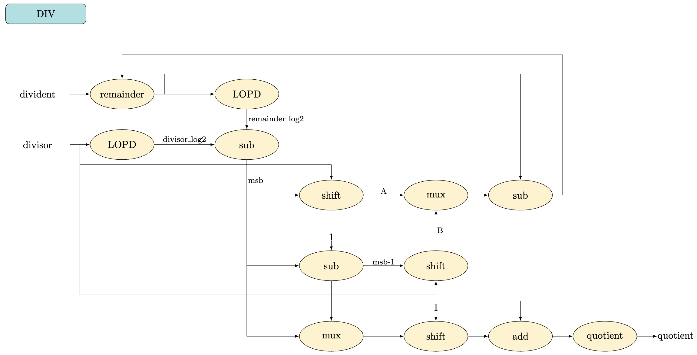
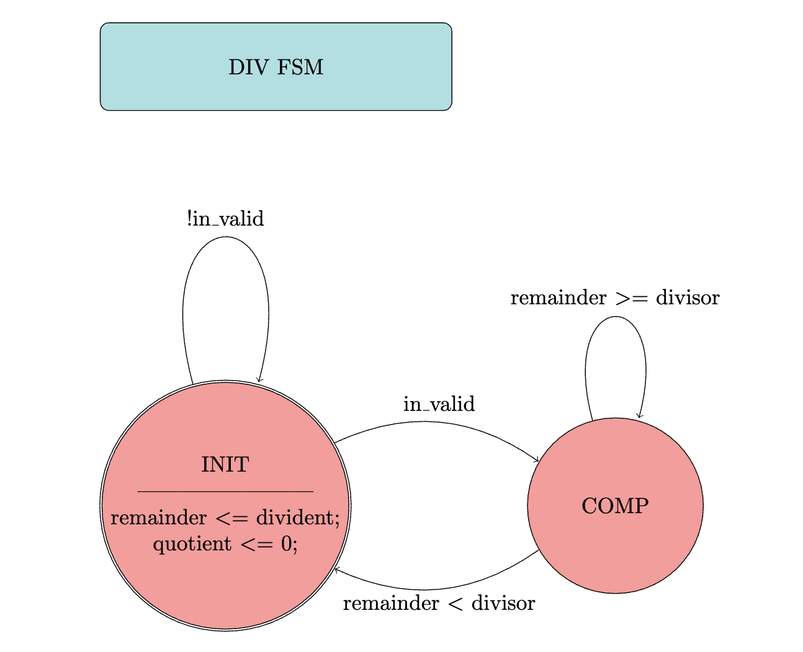
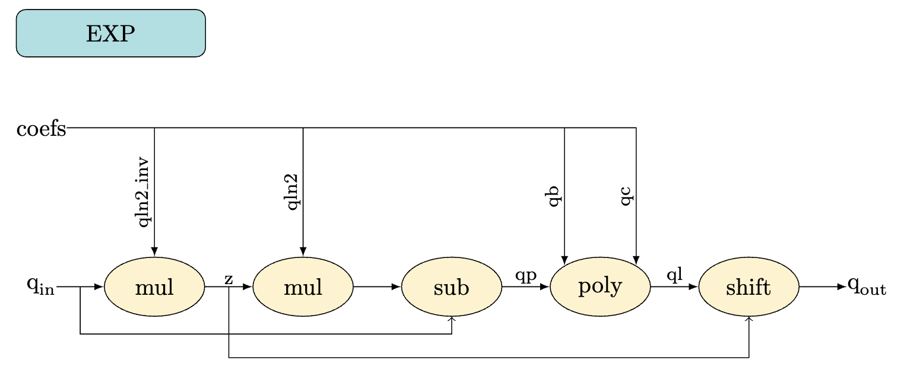
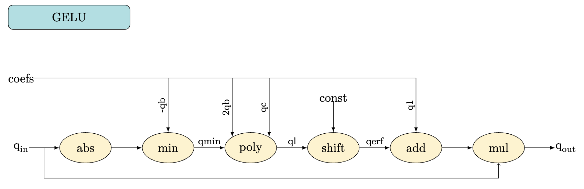
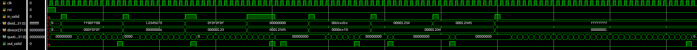
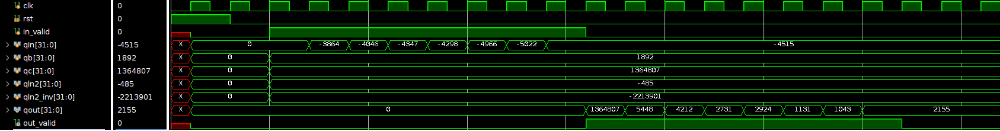
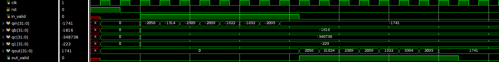

# LAB2: Division (DIV), Exponent (EXP), GELU [Design, Simulation, Synthesis, Implementation]

## "The Battle of the Line", Babylon 5

Deadline: 6th Feb 2025 23:59

## Getting Started
First, clone the git repository onto your home directory on the `eceubuntu` lab server.

```zsh
mkdir -p $HOME/ece327-w25/labs
cd $HOME/ece327-w25/labs
git clone ist-git@git.uwaterloo.ca:ece327-w25/labs/v2sharda-lab2.git
cd v2sharda-lab2
```

## Lab Objectives

The objective of the second lab is to introduce you to the Vivado tool to run synthesize and implementation steps for your design. Specifically, you will design the following modules:
* `div.sv` - multi-cycle integer **Division** module that computes `quotient = floor(dividend / divisor)` using FSM-based control.
* `exp.sv` - fully pipelined integer **Exponent** module that computes `qout = exp(qin)` using second-order polynomial approximation.
* `gelu.sv` - fully pipelined integer **GELU** module that computes `qout = gelu(qin)` using second-order polynomial approximation.

## Design

In this lab, you will make changes only to these three files:
`div.sv`, `exp.sv`, and `gelu.sv`.

#### DIV module

Python implementation of the division algorithm is given in `div.py`:

```python
def div(dividend: int, divisor: int) -> int:
    '''
        dividend - input, numerator, positive integer
        divisor - input, denominator, positive integer
        quotient - output, positive integer
    '''
    remainder = dividend
    quotient = 0
    divisor_log2 = floor(log2(divisor))             # LOPD
    while (remainder >= divisor):
        remainder_log2 = floor(log2(remainder))     # LOPD
        msb = remainder_log2 - divisor_log2         # sub
        A = divisor << msb                          # shift  
        B = A >> 1                                  # shift
        if remainder < A:
            remainder = remainder - B               # sub
            quotient = quotient + 2**(msb-1)        # shift, add
        else:
            remainder = remainder - A               # sub
            quotient = quotient + 2**msb            # shift, add
    return quotient
```

Algorithm:

* Revision of the terms: `dividend = quotient * divisor + remainder`.
* If you want to learn more about the _Quick-Div_ algorithm, check this paper ["Rethinking Integer Divider Design for FPGA-based Soft-Processors"](https://ieeexplore.ieee.org/document/8735506).
* First, we initialize remainder with the value of dividend, and quotient as 0.
* Then, we find integer log2 of divisor and remainder. Integer log2 is implemented as Leading One Position Detector (LOPD) and already provided to you in `lopd.sv`. You should use it to instantiate two LOPD instances in `div.sv` to find log2 of divisor and remainder, respectively.
* Loop behaviour should be implemented using FSM-based control with two states: `INIT` and `COMP`.
`INIT` stands for initialization or waiting for valid inputs.
`COMP` stands for computing or calculating division output, i.e., loop body.
* We subtract shifted divisor value from remainder until it gets lesser than divisor, while incrementing quotient value.

Diagram of the DIV module is given below.

NOTE: Intermediate signals were shown with the same names as in the python code. Given diagram is for reference only, and may omit some of the details needed for DIV hardware.



The following is the parameter of the `div.sv` module:

- `D_W` : data width of the inputs and output.

The following are the I/O ports of the `div.sv` module:

* `clk` : 1 bit input : This is the clock input.
* `rst` : 1 bit input : This is a synchronous active high reset.
* `in_valid` : 1 bit input : This instructs that current inputs are valid and can be consumed by DIV module.
* `divisor` : D_W bits input : This is the divisor input.
* `dividend` : D_W bits input : This is the dividend input.
* `quotient` : D_W bits output : This is the output of the DIV module.
* `out_valid` : 1 bit output : This instructs that current output is valid and can be consumed by top module.

Description:

* The `clk` signal is generated in the testbench and provided to your module. You are expected to operate on the positive edge of the clock.
* The `rst` signal is asserted initially by the testbench for a single clock cycle. You are expected to reset all registers in your design to `0`, and set the `state` to `INIT`.
* When `in_valid` is high, DIV module should 'accept' current `divisor` and `dividend` inputs, set `quotient` to `0`, and change the current state to `COMP`.
* Within the `COMP` state, you should perform computations shown in the division algorithm above.
* Once the division computation finishes, `out_valid` should become high and state should return back to `INIT`.

FSM control of the DIV module is given below.



#### EXP module

Python implementation of the exponent algorithm is given in `exp.py`:

```python
def exp(qin: np.int32, qb: np.int32, qc: np.int32, qln2: np.int32, qln2_inv: np.int32, fp_bits: int) -> np.int32:
    '''
        qin - int32, input
        qb, qc, qln2, qln2_inv - int32, fixed inference coefficients
        fp_bits - constant, fixed point multiplication bits
        qout - int32, output, integer approximation of exp
        all internal signals are int64
    '''
    fp_mul = qin * np.int64(qln2_inv)   # mul
    z = fp_mul >> fp_bits
    qp = qin - z * qln2                 # mul, sub
    ql = (qp + qb) * qp + qc            # poly
    qout = np.int32(ql >> z)            # shift
    return qout
```

Algorithm:

* Calculation of exponent value usually requires floating point arithmetics which might need more hardware resources compared to integer arithmetics. To compute exponent using integer-only arithmetics, above algorithm uses second-order polynomial to approximate exponent within a limited range of real numbers.
* If you want to learn more about the integer exponent algorithm, check this paper ["I-BERT: Integer-only BERT Quantization"](https://arxiv.org/abs/2101.01321).
* Here, prefix `q` indicates that it is a quantized variable which means a real number was converted to an integer number using some scaling factor.
* For the purposes of this and future labs, all verilog modules work with integers only.

Diagram of the EXP module is given below.

NOTE: Intermediate signals were shown with the same names as in the python code. Given diagram is for reference only, and may omit some of the details needed for EXP hardware.



The following are the parameters of the `exp.sv` module:

* `D_W` : data width of the inputs and outputs.
* `FP_BITS` : number of bits that is taken by multiplication with `qln2_inv`.

The following are the I/O ports of the `exp.sv` module:

* `clk` : 1 bit input : This is the clock input.
* `rst` : 1 bit input : This is a synchronous active high reset.
* `in_valid` : 1 bit input : This instructs that current inputs are valid and can be consumed by EXP module.
* `qin` : D_W bits input : This is the input data.
* `qb` : D_W bits input : This is the input coefficient.
* `qc` : D_W bits input : This is the input coefficient.
* `qln2` : D_W bits input : This is the input coefficient.
* `qln2_inv` : D_W bits input : This is the input coefficient.
* `out_valid` : 1 bit output : This instructs that current output is valid and can be consumed by top module.
* `qout` : D_W bits output : This is the output of the EXP module.

Description:

* The `clk` signal is generated in the testbench and provided to your module. You are expected to operate on the positive edge of the clock.
* The `rst` signal is asserted initially by the testbench for a single clock cycle. You are expected to reset all registers in your design to `0`.
* The input data `qin` and input coefficients `qb`, `qc`, `qln2`, and `qln2_inv` are supplied every clock cycle in a continuous fashion after `rst` is de-asserted.
* Exponent calculation should be split into multiple pipeline stages to improve performance. This means you have to properly implement pipeline registers to propagate input values to the necessary stage. For example, if you implement polynomial function that computes `ql` in stage-3, you should also propogate `qp`, `qb`, and `qc` until stage-3 through pipeline registers.
* EXP module should have full throughput, meaning that input values are consumed every clock cycle and output is produced every clock cycle.
* All the internal signals shown in the EXP python algorithm should have data width of `2 * D_W` bits.
* `out_valid` should be high whenever `qout` has a valid exponent value computation. Hint: output is valid, when it has a value computed from valid inputs...

#### GELU module

Python implementation of the GELU algorithm is given in `gelu.py`:

```python
def gelu(qin: np.int32, qb: np.int32, qc: np.int32, q1: np.int32, shift: int) -> np.int32:
    '''
        qin - int32, input
        qb, qc, q1 - int32, fixed inference coefficients
        shift - constant, shift amount
        qout - int32, output, integer approximation of gelu
        all internal signals are int32
    '''
    qsgn = np.sign(qin)
    qmin = np.minimum(np.abs(qin), -qb)     # abs, min
    ql = (qmin + 2 * qb) * qmin + qc        # poly
    qerf = qsgn * ql
    qerf = qerf >> shift                    # shift
    qout = np.int32(qin * (qerf + q1))      # add, mul
    return qout
```

Algorithm:

* Similar to exponent, GELU calculation uses second-order polynomial function using integer-only arithmetic.
* For more details, check this paper ["I-BERT: Integer-only BERT Quantization"](https://arxiv.org/abs/2101.01321).
* `min` function here just chooses whichever operand is lesser.

Diagram of the GELU module is given below.

NOTE: Intermediate signals were shown with the same names as in the python code. Given diagram is for reference only, and may omit some of the details needed for GELU hardware.



The following are the parameters of the `gelu.sv` module:

* `D_W` : data width of the input.
* `SHIFT` : number of bits needed to shift `qerf` variable.

The following are the I/O ports of the `gelu.sv` module:

* `clk` : 1 bit input : This is the clock input.
* `rst` : 1 bit input : This is a synchronous active high reset.
* `in_valid` : 1 bit input : This instructs that current inputs are valid and can be consumed by GELU module.
* `qin` : D_W bits input : This is the input data.
* `qb` : D_W bits input : This is the input coefficient.
* `qc` : D_W bits input : This is the input coefficient.
* `q1` : D_W bits input : This is the input coefficient.
* `out_valid` : 1 bit output : This instructs that current output is valid and can be consumed by top module.
* `qout` : D_W bits output : This is the output data of the GELU module.

Description:

* GELU has a similar design as EXP module. Therefore, all signals share the same behaviour.
* GELU is also a full throughput pipelined module.
* All the internal signals shown in the GELU python algorithm should have data width of `D_W` bits.
* Reminder: sign of a signed signal is encoded in its MSB, 1 - negative, 0 - positive.

## Simulation

To compile and simulate a module using `xsim`, simply type:

```zsh
make div-xsim
make exp-xsim
make gelu-xsim
```

You can add `GUI=1` option to launch `xsim` in GUI mode to see the waveforms:
```zsh
make div-xsim GUI=1
```

You can also edit, e.g., add `print` statements to monitor variable values, all given python files (`div.py`, `exp.py`, `gelu.py`) for debugging purposes and run them using:

```zsh
make div-py
make exp-py
make gelu-py
```

#### Expected Simulation Output for DIV Module

Below is the expected output of running `make div-xsim`. The text trace is the output of `$display` statements from the `div_tb.sv`. Successful completion of the test should show "PASSED!" message.

```txt
# Time=27, outputs=0, dividend=4278255360, divisor=986895, quotient=4335, true=4335, latency=10 cycles
# Time=53, outputs=1, dividend=305419896, divisor=10, quotient=30541989, true=30541989, latency=12 cycles
# Time=81, outputs=2, dividend=252645135, divisor=291, quotient=868196, true=868196, latency=14 cycles
# Time=85, outputs=3, dividend=0, divisor=74565, quotient=0, true=0, latency=2 cycles
# Time=111, outputs=4, dividend=14593470, divisor=61168, quotient=238, true=238, latency=8 cycles
# Time=123, outputs=5, dividend=4660, divisor=4660, quotient=1, true=1, latency=3 cycles
# Time=145, outputs=6, dividend=74565, divisor=4660, quotient=16, true=16, latency=3 cycles
# Time=229, outputs=7, dividend=4294967295, divisor=1, quotient=4294967295, true=4294967295, latency=34 cycles

--
PASSED!
--
```

When you run `make div-xsim GUI=1` to launch `xsim` in GUI mode, below is an example waveform.



#### Expected Simulation Output for EXP Module

Below is the expected output of running `make exp-xsim`. The text trace is the output of `$display` statements from the `exp_tb.sv`. Successful completion of the test should show "PASSED!" message.

```txt
# Time=5, in_valid=0, in_cntr=0, qin=0, out_valid=0, out_cntr=0, qout=0
# Time=7, in_valid=1, in_cntr=1, qin=0, out_valid=0, out_cntr=0, qout=0
# Time=9, in_valid=1, in_cntr=2, qin=-3864, out_valid=0, out_cntr=0, qout=0
# Time=11, in_valid=1, in_cntr=3, qin=-4046, out_valid=0, out_cntr=0, qout=0
# Time=13, in_valid=1, in_cntr=4, qin=-4347, out_valid=0, out_cntr=0, qout=0
# Time=15, in_valid=1, in_cntr=5, qin=-4298, out_valid=0, out_cntr=0, qout=0
# Time=17, in_valid=1, in_cntr=6, qin=-4966, out_valid=0, out_cntr=0, qout=0
# Time=19, in_valid=1, in_cntr=7, qin=-5022, out_valid=0, out_cntr=0, qout=0
# Time=21, in_valid=1, in_cntr=8, qin=-4515, out_valid=0, out_cntr=0, qout=0
# Time=23, in_valid=0, in_cntr=8, qin=-4515, out_valid=1, out_cntr=0, qout=1364807
# Time=25, in_valid=0, in_cntr=8, qin=-4515, out_valid=1, out_cntr=1, qout=5448
# Time=27, in_valid=0, in_cntr=8, qin=-4515, out_valid=1, out_cntr=2, qout=4212
# Time=29, in_valid=0, in_cntr=8, qin=-4515, out_valid=1, out_cntr=3, qout=2731
# Time=31, in_valid=0, in_cntr=8, qin=-4515, out_valid=1, out_cntr=4, qout=2924
# Time=33, in_valid=0, in_cntr=8, qin=-4515, out_valid=1, out_cntr=5, qout=1131
# Time=35, in_valid=0, in_cntr=8, qin=-4515, out_valid=1, out_cntr=6, qout=1043
# Time=37, in_valid=0, in_cntr=8, qin=-4515, out_valid=1, out_cntr=7, qout=2155
# Time=39, in_valid=0, in_cntr=8, qin=-4515, out_valid=0, out_cntr=8, qout=2155
# Time=41, in_valid=0, in_cntr=8, qin=-4515, out_valid=0, out_cntr=8, qout=2155
# Time=43, in_valid=0, in_cntr=8, qin=-4515, out_valid=0, out_cntr=8, qout=2155
# Time=45, in_valid=0, in_cntr=8, qin=-4515, out_valid=0, out_cntr=8, qout=2155
[...]

--
PASSED!
--
```

When you run `make exp-xsim GUI=1` to launch `xsim` in GUI mode, below is an example waveform.



#### Expected Simulation Output for GELU Module

Below is the expected output of running `make gelu-xsim`. The text trace is the output of `$display` statements from the `gelu_tb.sv`. Successful completion of the test should show "PASSED!" message.

```txt
# Time=5, in_valid=0, in_cntr=0, qin=0, out_valid=0, out_cntr=0, qout=0
# Time=7, in_valid=1, in_cntr=1, qin=-2058, out_valid=0, out_cntr=0, qout=0
# Time=9, in_valid=1, in_cntr=2, qin=-1314, out_valid=0, out_cntr=0, qout=0
# Time=11, in_valid=1, in_cntr=3, qin=-2309, out_valid=0, out_cntr=0, qout=0
# Time=13, in_valid=1, in_cntr=4, qin=-2089, out_valid=0, out_cntr=0, qout=0
# Time=15, in_valid=1, in_cntr=5, qin=-1822, out_valid=0, out_cntr=0, qout=0
# Time=17, in_valid=1, in_cntr=6, qin=-1692, out_valid=0, out_cntr=0, qout=0
# Time=19, in_valid=1, in_cntr=7, qin=-2093, out_valid=0, out_cntr=0, qout=0
# Time=21, in_valid=1, in_cntr=8, qin=-1741, out_valid=0, out_cntr=0, qout=0
# Time=23, in_valid=0, in_cntr=8, qin=-1741, out_valid=1, out_cntr=0, qout=2058
# Time=25, in_valid=0, in_cntr=8, qin=-1741, out_valid=1, out_cntr=1, qout=21024
# Time=27, in_valid=0, in_cntr=8, qin=-1741, out_valid=1, out_cntr=2, qout=2309
# Time=29, in_valid=0, in_cntr=8, qin=-1741, out_valid=1, out_cntr=3, qout=2089
# Time=31, in_valid=0, in_cntr=8, qin=-1741, out_valid=1, out_cntr=4, qout=1822
# Time=33, in_valid=0, in_cntr=8, qin=-1741, out_valid=1, out_cntr=5, qout=3384
# Time=35, in_valid=0, in_cntr=8, qin=-1741, out_valid=1, out_cntr=6, qout=2093
# Time=37, in_valid=0, in_cntr=8, qin=-1741, out_valid=1, out_cntr=7, qout=1741
# Time=39, in_valid=0, in_cntr=8, qin=-1741, out_valid=0, out_cntr=8, qout=1741
# Time=41, in_valid=0, in_cntr=8, qin=-1741, out_valid=0, out_cntr=8, qout=1741
# Time=43, in_valid=0, in_cntr=8, qin=-1741, out_valid=0, out_cntr=8, qout=1741
# Time=45, in_valid=0, in_cntr=8, qin=-1741, out_valid=0, out_cntr=8, qout=1741
[...]

--
PASSED!
--
```

When you run `make gelu-xsim GUI=1` to launch `xsim` in GUI mode, below is the example waveform.



## Synthesis

To synthesize a module using `vivado`, simply type:

```zsh
make div-synth
make exp-synth
make gelu-synth
```

Vivado will run synthesis step for the specified module.
If synthesis is successful, Vivado will save the synthesized module (post-synthesis module) as `div_synth.sv` /  `exp_synth.sv` / `gelu_synth.sv` file.
Watch out for any error messages printed by Vivado during synthesis.

After completion of the synthesis step, you can run **post-synthesis simulation** using synthesized modules:

```zsh
make div-synth-xsim
make exp-synth-xsim
make gelu-synth-xsim
```

Similar to the previous simulation step, successful completion of the post-synthesis simulation test should show "PASSED!" message for each module.

## Implementation

To run the implementation step for a module using `vivado`, simply type:

```zsh
make div-impl
make exp-impl
make gelu-impl
```

Vivado will run the implementation step for the specified module.
After completion of the implementation step, modules will be placed and routed.
Output module will be saved (post-place-and-route module) as `div_impl.sv` /  `exp_impl.sv` / `gelu_impl.sv` file.
Watch out for any error messages printed by Vivado during implementation.

At the end of Place and Route, Vivado will generate a file called `div_util.txt` / `exp_util.txt` / `gelu_util.txt` with information about resource consumption of your design. Quality of your design will be evaluated by the number of LUTs ('Slice LUTs'), Flip-Flops ('Slice Registers'), and DSPs. You can see reference numbers for the utilization in the provided `div_util.golden` / `exp_util.golden` / `gelu_util.golden` files.

After completion of the implementation step, you can run **post-implementation simulation**:

```zsh
make div-impl-xsim
make exp-impl-xsim
make gelu-impl-xsim
```

## Grading

To grade your code, just type:

```zsh
make grade
```

This grade rule will run `grade.sh` script and fill in `grade.csv` file with your marks. This is the script we will use to grade you and we are giving you this script to self-assess. This will be our policy for all the labs.

Lab2 grading breakdown:
- 15% of the lab grade will be reserved for passing `make div-xsim`. The script will check for the absence of "Error" messages and the presence of a "PASSED!" message in the simulation output.
- 10% of the lab grade will be reserved for passing `make exp-xsim`. The script will check for the absence of "Error" messages and the presence of a "PASSED!" message in the simulation output.
- 10% of the lab grade will be reserved for passing `make gelu-xsim`. The script will check for the absence of "Error" messages and the presence of a "PASSED!" message in the simulation output.
- 10% of the lab grade will be reserved for passing `make div-synth-xsim`. The script will check for the succesfull completion of the synthesis step, i.e., `div_synth.sv` is present, and for correct post-synthesis simulation output.
- 8% of the lab grade will be reserved for passing `make exp-synth-xsim`. The script will check for the succesfull completion of the synthesis step, i.e., `exp_synth.sv` is present, and for correct post-synthesis simulation output.
- 8% of the lab grade will be reserved for passing `make gelu-synth-xsim`. The script will check for the succesfull completion of the synthesis step, i.e., `gelu_synth.sv` is present, and for correct post-synthesis simulation output.
- 18% of the lab grade will be reserved for checking the number of resources utilized after implementation step: 6% for each module. The script will check if all of the following is true: number of LUTs is not 0, number of Flip-Flops is not 0, percentage difference from the golden utilization value is not greater than 20% for LUTs, Flip-Flops, and DSPs.
- 15% of the lab grade of the lab grade will be reserved for passing timing constraints: 5% for each module. We accept slack higher than -0.3ns.
- 6% of the lab grade will be reserved for verilator lint generating no "Error" message: 2% for each module. The lint checks help guard against bad coding practices.
- Penalty for late submissions is 0% of the grade.

Our scripts will replace all the test files, such as, `div_in.mem`, `div_tb.sv`, `grade.sh`, etc., so do not rely on edits in these files. You only need to edit `div.sv`, `exp.sv`, and `gelu.sv`.

## Submission

Go to the cloned git repository for lab2.

Please fill in your solution code in `div.sv`, `exp.sv`, and `gelu.sv` and ensure that the test outputs match the waveforms shown above.

You can commit your design in two steps:
```
git commit -a -m "I am both terrified and reassured to know that there are still wonders in the universe (ECE327 and 627 labs)…that we have not yet explained everything -- G'kar, Narn Ambassdor to Babylon 5 space station"
git push origin master
```

You may commit and push as many times as you want prior to submission deadline.
The most recently pushed commit prior to the deadline will be graded.
The contents of the commit message do not matter.

Frequently committing and pushing your code to the repository is recommended, so you can track your design progress over time under `Activity` tab on `git.uwaterloo.ca` in the browser.

