# LAB3: Matrix Multiplication Module [Design, Simulation, Synthesis, Implementation, and Deployment on the _PYNQ_ Board]
## "Battle of Ragnar Anchorage", Battlestar Galactica

Deadline: 13th March 2025 23:59

## Getting started
First, clone the git repository onto your home directory on the `eceubuntu` lab server.

```zsh
mkdir -p $HOME/ece327-w25/labs
cd $HOME/ece327-w25/labs
git clone ist-git@git.uwaterloo.ca:ece327-w25/labs/v2sharda-lab3.git
cd v2sharda-lab3
```

## Lab Objectives

Matrix multiplication is a popular kernel in high-performance scientific computing, gaming, and now even machine learning workloads.
Companies like NVIDIA build GPU hardware that excels at the task of performing matrix multiplication.
In contemporary usage, matrix multiplication hardware has even made it into the core of the Google Tensor Processing Unit (TPU).
FPGAs are also competent at matrix multiplication particularly from the perspective of energy efficiency.

The objective of the third lab is to build a matrix multiplication module, then synthesize, implement, and download your bitstream to the _PYNQ_ board and run the Python-based test framework to confirm correct operation. Specifically, you will design the following modules:
* `pe.sv` - **Processing Element** module that computes `out_data = out_data + in_a * in_b`.
* `systolic.sv` - **Systolic** module that instantiates 2D grid of PE modules and computes `D = np.matmul(A, B)`.
* `mem_write_A.sv`, `mem_write_B.sv`, and `mem_read_D.sv` - **Address Generator** modules that will create a cascade of counters to compute write addresses
for input A/B matrices, and read addresses for output D matrix. The input and
output matrices are partitioned across memory banks.
* ECE627 only: `mem_write_B_pp.sv`, and `mem_read_D_pp.sv` - **Address Generator** similar to the previous address generators but designed for double buffered memory banks.

## Design

We will now investigate detailed operation of the systolic core and the PEs. These components are the two key building blocks of your design. We show a high-level picture of the systolic array below:

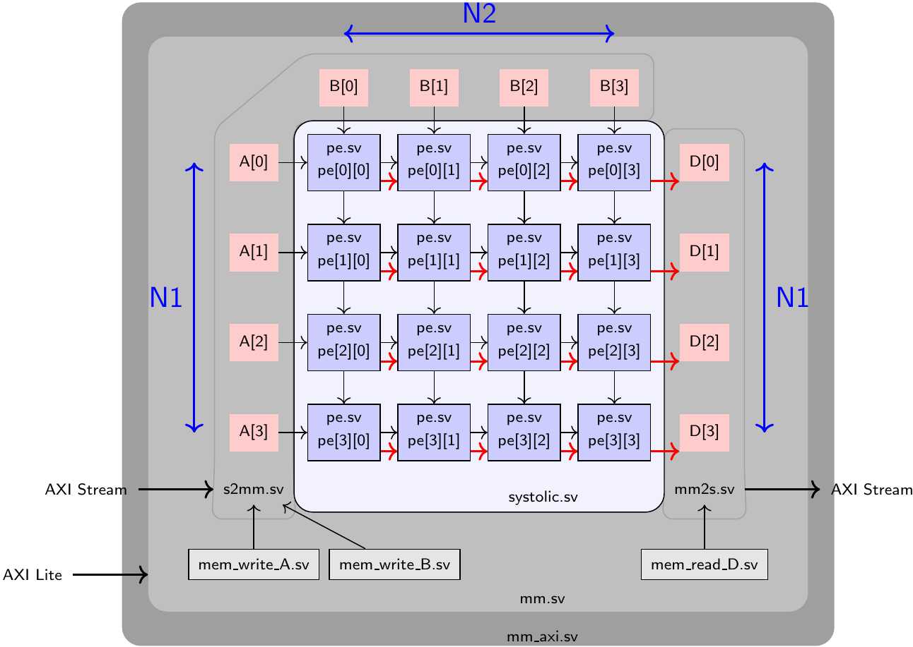

We will provide the required hardware infrastructure to generate input matrices on the ARM CPU of the FPGA board, send it to your systolic core, and read the result back to the ARM CPU for validation.
We will use the _PYNQ_ FPGA board for this lab, which is a hybrid FPGA + ARM SoC (System-on-Chip) that allows you to run an embedded Linux stack on the ARM CPU and use the FPGA as an accelerator. 
Pynq board also ships with user-friendly Python APIs which we will use for programming and interacting with the FPGA.

#### Systolic Data Flow

A systolic array is a 2D grid of simple computing elements connected to each other in nearest neighbour fashion.
Dataflow through the array proceeds in a systolic fashion (one hop at a time), new elements injected into the array from the left (`A`) and top (`B`) flanks per cycle.
The co-ordination of data injection is crucial for correct evaluation of the computation.
2D systolic array has parameterizable dimensions N1xN2. The left column and top row of the array will stream input matrices `A` and `B`.

So, how exactly are `A` and `B` streamed? This depends on the size of the systolic array N1xN2 and the size of the matrices `A` (M1xM2) and `B` (M2xM3).

In this manual, where we specify only single value of M, it means M1=M2=M3=M, and similarly if only single value of N is specified, then N1=N2=N.

**M=N case:** For simplicity, first let us assume M=N=4, which means the matrix dimensions match the systolic size.

The matrix `A` will be streamed from the left of the 4x4 systolic array in a row-wise fashion. Each row of the systolic array will receive a streaming row of matrix `A`. Thus, we will read four rows of `A` in parallel with some offset. This offset generation is handled by `s2mm.sv` and `mm2s.sv` modules.
The matrix `B` will be streamed from the top of the 4x4 systolic array in a column-wise fashion. Each column of the systolic array will receive a streaming column of matrix `B`. Thus, we will read four columns of `B` in parallel with some cycle.
For details of how this works, please refer to Lecture 3b: Top-Down Synthesis lecture.

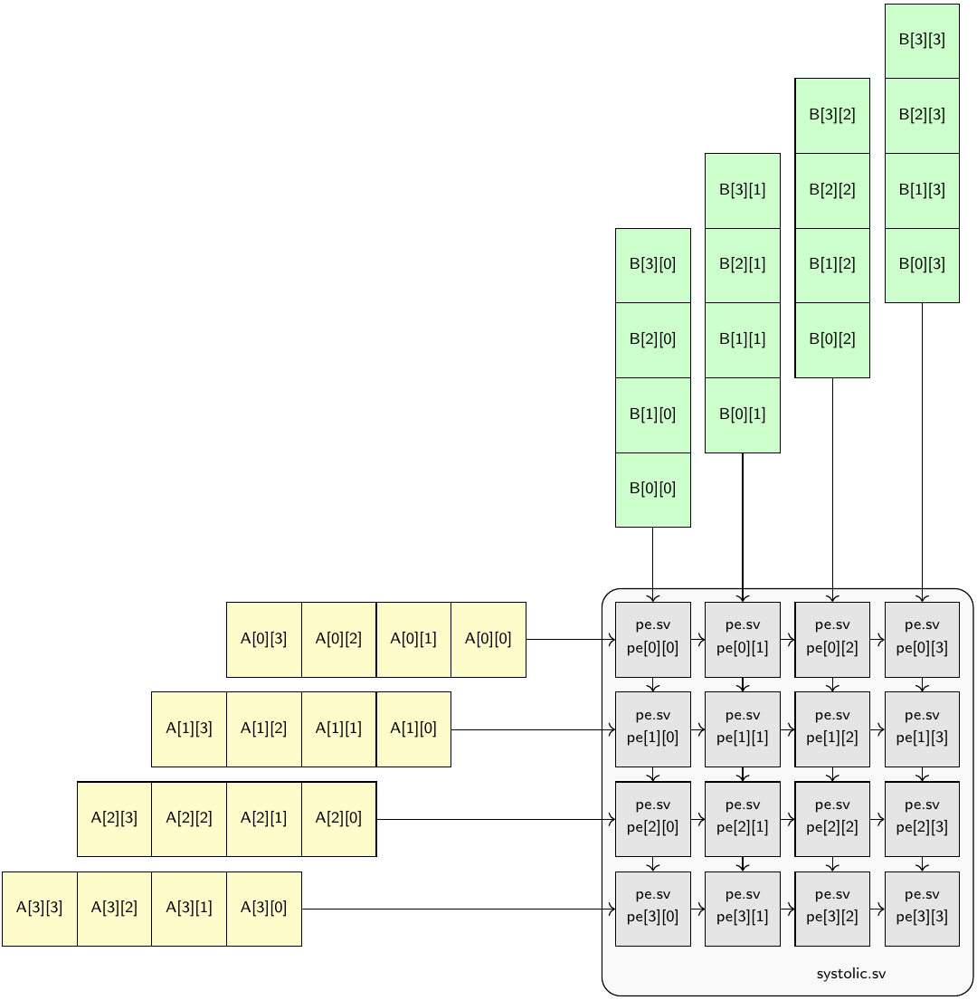

**M>N case:** Let us now consider the case where M>N, i.e., matrices are larger than the systolic array size. We will restrict our discussion for cases where M is a multiple of N.

We can consider an example with M=8 and N=4, as shown in the images below to understand the concept of phases (or folding). Since M > N, it is clear that the entire matrix cannot simply be streamed to generate the multiplied output in one-shot. Instead, we break the input into patches of size NxM (4xM) for `A` and MxN (Mx4) for `B` and stream those sets of rows/columns into the array.  Here, computation will proceed in four phases. Click on the images to expand them to full resolution.

Phase 1|  Phase 2 | Phase 3 | Phase 4
:----:|:----:|:----:|:----:
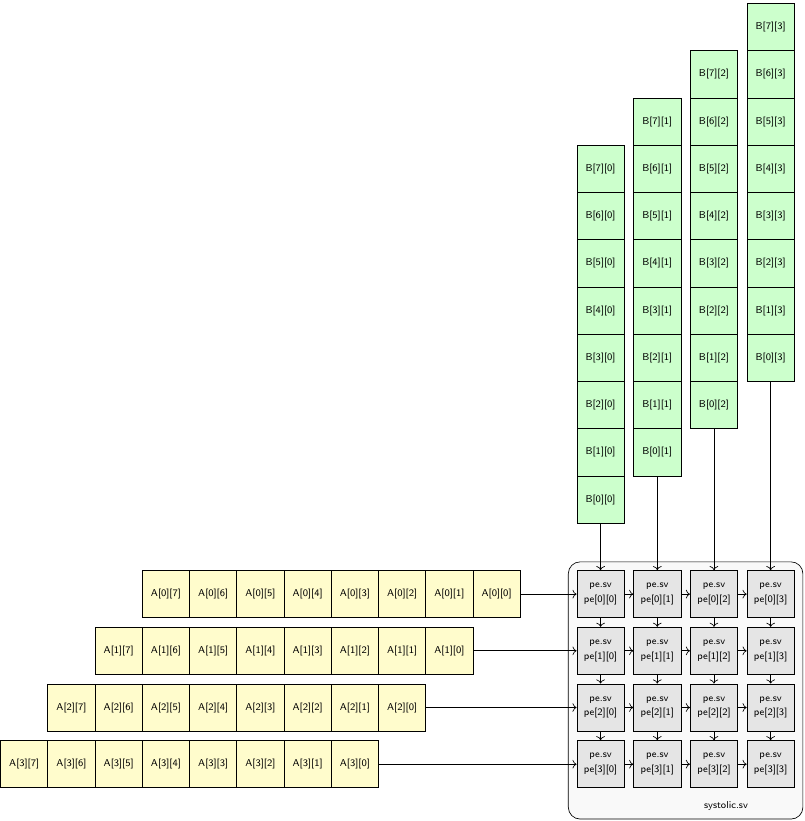 | 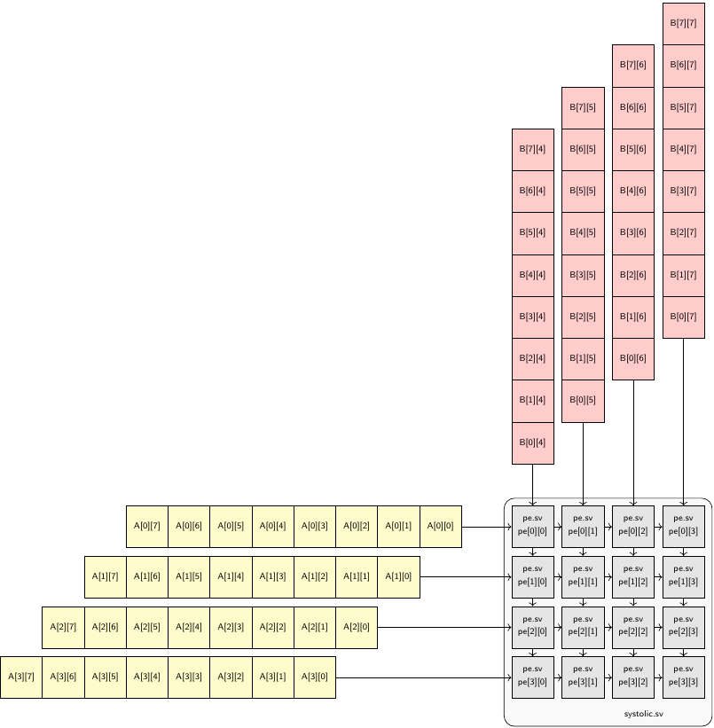 | 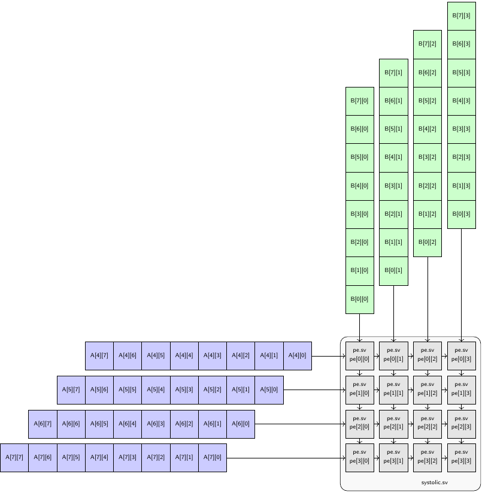 | 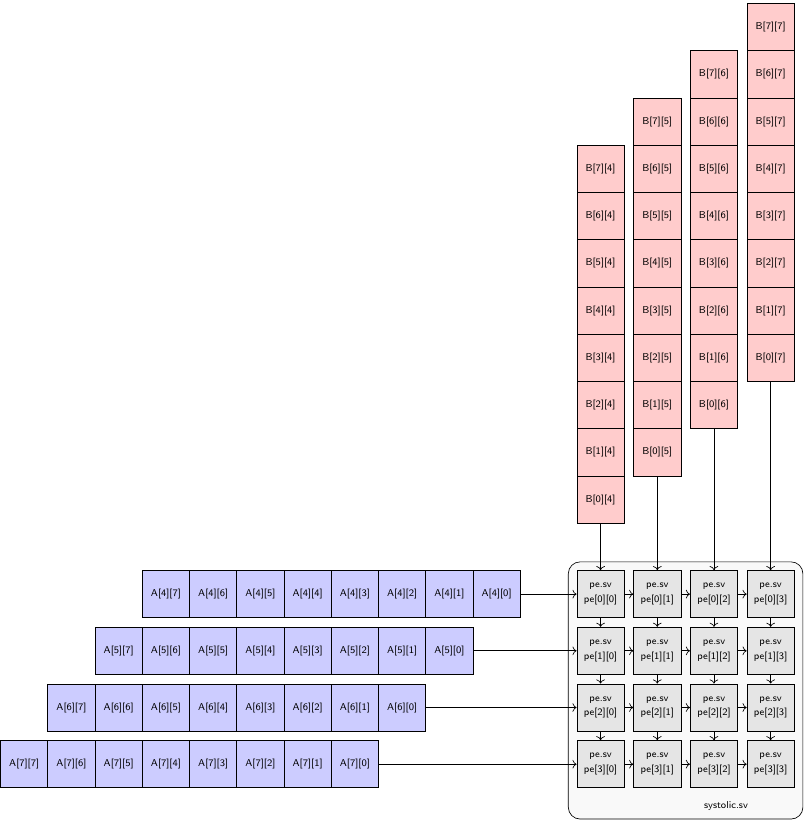 |

* In the first phase, the yellow region will be multiplied with the green region. Here, the entire row and column will be streamed even though they are larger than the systolic array size. This is fine, as we are effectively processing the matrix in chunks.
* In the second phase, the yellow region will be multiplied by red.
* In the third phase, the blue region will be multiplied with green.
* Finally, the blue region will be multiplied by the red region.
	
Depending on the ratio of M/N, the number of such combinations will be (M/N)^2.

#### Systolic Module

The following are the parameters of the `systolic.sv` module:

* `D_W` : data width of the inputs.
* `D_W_ACC` : data width of the accumulator.
* `N1` : number of rows of the systolic array.
* `N2` : number of columns of the systolic array.

The following are the I/O ports of the `systolic.sv` module:

* `clk` : 1 bit input : This is the clock input.
* `rst` : 1 bit input : This is a synchronous active high reset.
* `init` : N1 x N2 input : This is the init signal that flushes the accumulator. 
* `A` : D_W bits x N1 input : `A`'s data lane to feed into systolic array.
* `B` : D_W bits x N2 input : `B`'s data lane to feed into systolic array.
* `D` : D_W_ACC bits x N1 output: Data bus for `D` output of the systolic array.
* `valid_D` : N1 bits output : Valid bus of `D` output.

Description:

* `systolic.sv` is a systolic matrix multiplication module that instantiates a 2D grid of PEs. You will need to use Verilog `generate` statement to construct an array of N1xN2 parametric dimensions. You will also need to create intermediate signals to wire-up the inputs and outputs of PEs correctly.
* The matrix inputs `A` and `B` will use the Verilog 2D array construct to supply multiple values to the systolic core per cycle. Input `A` has a dimension of N1, and should be connected to `in_a` inputs of leftmost column PEs, and input `B` has a dimension of N2, and should be connected to `in_b` inputs of the topmost row PEs. For example, for a 4x4 systolic dimension, `A[0]` will connect to `PE[0][0]`, `A[1]` will connect to `PE[1][0]`, `B[3]` will connect to `PE[0][3]` as shown in the figures above.
* Then, other PEs should be connected in a systolic fashion to each other, such that the inputs `A` and `B` are forwarded to the next PEs along the row and column. `A` should propogate horizontally (left-to-right), while `B` values should traverse vertically (top-to-bottom).
* `init` is a 2D signal and should be connected to each PE and be used to restart the accumulation process.
* Once a PE finishes computing an element of output matrix, e.g. `PE[0][0]` finished the dot product of the first row of `A` and the first column of `B`, result should be shifted out through its right neighbour. The red link shown in the first figure above represents this shifting out of the results. Outputs of the rightmost column PEs should be connected to the output `D` which has a dimension of `N1`. Note that the results of the `PE[*,N2-1]` are pushed out to `D` first. In the first figure above, `PE[*][3]` will shift out first.
* Your systolic design should also output an array of 1 bit `valid_D` signal, indicating that `D` has a valid partial matrix products.

#### PE Module

The following are the parameters of the `pe.sv` module:

* `D_W` : data width of the inputs.
* `D_W_ACC` : data width of the accumulator.

The following are the I/O ports of the `pe.sv` module:

* `clk` : 1 bit input : This is the clock input to the module.
* `rst` : 1 bit input : This is a synchronous reset signal.
* `init` : 1 bit input : This is the init signal that restarts the accumulation.
* `in_a` : D_W bits input : This is the first PE operand.
* `in_b` : D_W bits input : This is the second PE operand.
* `in_data` : D_W_ACC bits input : This is the input stream of `D` matrix data.
* `in_valid` : 1 bit input : Valid signal for `in_data`.
* `out_a` : D_W bits output : This is the output that streams out registered in_a.
* `out_b` : D_W bits output : This is the output that streams out registered in_b.
* `out_data` : D_W_ACC output : This is the output stream of `D` matrix data.
* `out_valid` : 1 bit output : Valid signal for `out_data`.

Description:

* `pe.v` performs multiply-accumulate operation on streaming inputs `in_a` and `in_b`. This is your Lab1 code with minor modifications to allow systolic assembly.
* `init` signal restarts the accumulation process.
* `in_data` is the incoming data from the left neighbour. When `in_valid` is high, PE should register `in_data` and pass it to its right neighbour through `out_data`.
* PE should register inputs `in_a` and `in_b` and pass it through `out_a` and `out_b`.
* Both the values calculated by the `pe`, i.e., accumulator result, and the values received from its neighbors to the left in the same row (`in_data`), must be outputted through `out_data`. Note the order in which the values appear in `out_data` from the table in 'Expected Simulation Output for PE Module' in the 'Simulation' section below.
* `out_valid` is used to indicate: when valid `in_data` is passed, or when valid accumulator result is outputted.
* PEs cannot be paused and must continue to process the next multiply-accumulate while previous results are shifting out.

#### Memory Address generators

The input and output matrices for the matrix-multiplication are stored in RAM
banks. 

- Matrix A is partitioned row-wise across the banks and each row is fed serially
into the `in_a` port of the `systolic.sv` module. The AXI stream suppling the A
matrix provides this data in row-serial fashion with elements supplied from
top-left to bottom-right corner of the matrix one item per cycle. The file
`mem_write_A.sv` will generate the sequence of write addresses for each memory
bank storing A.
- Matrix B is partitioned column-wise across the banks and each column is fed serially
into the `in_b` port of the `systolic.sv` module. Even though B is read in
column-wise fashion when entering the systolic array, it is supplied by the
external world in row-serial fashion. The reason for this will become clear in
Lab4, when we have to potentially cascade multiple systolic arrays together for
the IBERT Attention Head. The file `mem_write_B.sv` will generate the sequence
of write addresses for each memory bank storing B. This is *slightly* tricky as
you have to do a row/column permutation, so build and test the generator for the
A matrix first.
- Matrix D is stored just like matrix A in row-wise fashion across the banks.
The systolic array output is streamined into the banks in row-wise fashion from
the `out_d` port in `systolic.sv`. The AXI output stream that supplies D to the
next stage of computation (for Lab4), or back to the ARM host (for Lab3) does so
in row-wise fashion as well. The file `mem_read_D.sv` will generate the sequence
of read addresses for each memory bank storing D. In fact, we suggest you design
and test this first, before touching the address generator for B.

The following picture illustrates how the A matrix are distributed across the N1
memory banks of A. Since matrix A has M1 rows, each bank will have M1/N1 rows. We
are going to use cyclic partitioning (interleaved addressing from Lecture 7b)
scheme to decide which rows goes into which bank. The colors represent how
consecutive rows of the matrix A are bunched in groups of N1 each and
scattered across each memory bank. Thus, row 0 goes to bank0, row 1 goes to
bank1, row2 does to bank2, .. row N1-1 goes to bankN1-1, and row N1 goes to
bank 0, ... Each set of N1 rows is then scattered across each bank until the
entire matrix is distributed across the memory banks. The job of
`mem_write_A.sv` is to produce the address pattern highlighted by the grey
line.

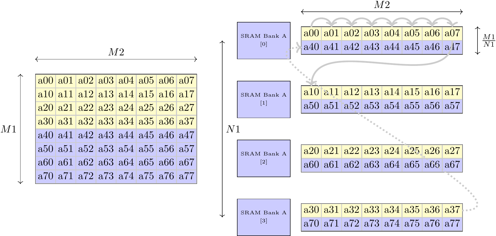

The following picture illustrates how the B matrix is distributed across the
N2 memory banks of B. Since matrix B has M3 columns, each bank will have M3/N2
columns. We are again going to use cyclic partioning scheme to distribute
columns across banks. If you pause and ask why that is, we want the first N1
rows of A and first N2 columns of B to be streaming into the systolic array
during its first use to compute the first N1 rows of D. The colors represent how
consecutive columns of the matrix B are bunched into groups of N2 columns each
and scattered across each memory bank. Thus, col 0 goes to bank0, col 1 goes to
bank1, ... , col N2-1 goes to bankN2-1, and col N2 does to bank0, ... Each set
of N2 columns is then scattered across each bank until the entire matrix is
distributed across the memory banks.  The job of `mem_write_B.sv` is to produce
the address pattern highlighted by the grey line.

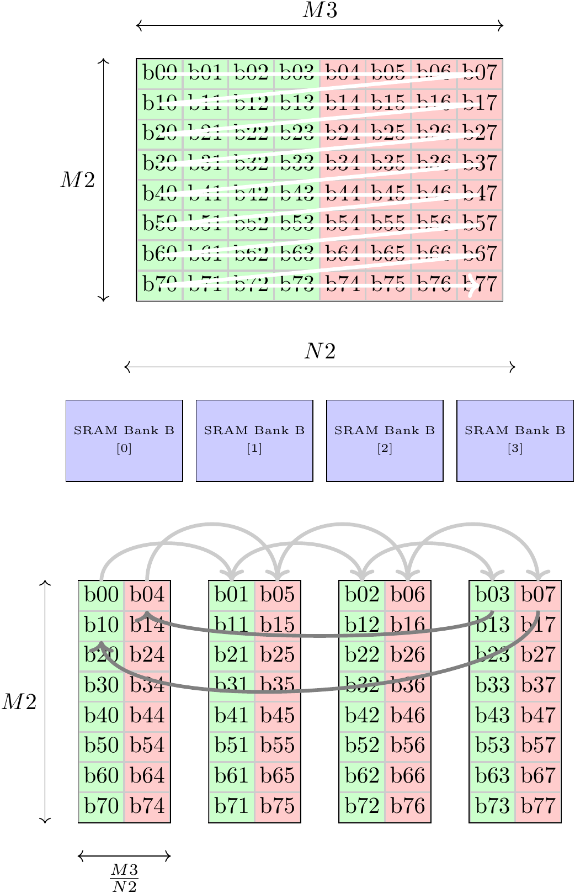

The following picture is for matrix D, and `mem_read_D.sv` generates the addres
pattern indicated by the grey line. The partitioning scheme is the same as
matrix A. The only caveat is that the systolic array shift data from the last
column first so the column order is mirrored.

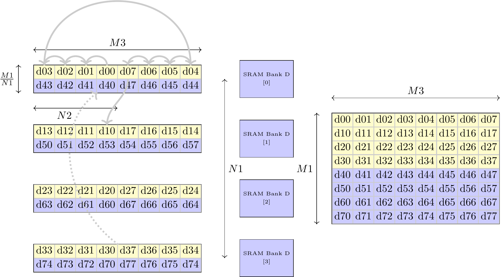

#### ECE627 Only: Double Buffered Memory Address generators

The `mem_write_B_pp.sv` module extends the functionality of `mem_write_B.sv` by introducing double buffering for managing overlapping writes to memory. This module is essential for systems requiring repetitive overwrites of the same memory regions without data loss.

In the context of this design, double buffering ensures that a memory block is overwritten only after it has been fully consumed. This behavior is coordinated using the `ping_pong_control.sv` module. The approach is particularly useful in pipelined designs where data is processed in blocks and reused across iterations.
In our design, you can think of a `BLOCK` as a group of columns of a matrix. For example, If `B=4x8` and `BLOCKS=2`, then each block of B is `4x4`.

##### Functionality

The primary task of `mem_write_B_pp.sv` is to manage writes to two blocks of memory (`B_0` and `B_1`) in a ping-pong fashion. It alternates between these banks, writing blocks of data repetitively to the same address ranges while ensuring data integrity. For example, if `BLOCK_NUM = 2`, the module writes:

1. Block 0 to `MEM B_0` in the address range corresponding to `BLOCK_SIZE/N2`.
2. Block 1 to `MEM B_1` in the same address range.
3. Block 2 back to `MEM B_0` in the same range, once Block 0 has been consumed.
4. Block 3 back to `MEM B_1` in the same range, once Block 1 has been consumed.

The alternation between banks within each memory block is controlled through the `activate_B` signal. However, the choice of which memory block to write to is controlled by `ping_pong_control.sv` which is out of this lab's scope.

##### Implementation

To design `mem_write_B_pp.sv`, you need to implement:

1. **Write Address Generation**: The `wr_addr_B` signal determines the write address within the active memory block, and the active memory bank indicated by `activate_B` signal. This calculation depends on the current column (`col`) and row (`row`) within the block. These counters ensure the addresses align with the repetitive overwrite strategy.
- `col` is the column index from 0 to `N2`.
- `row` is the row index from 0 to `M2*BlOCK_WIDTH/N2`.

you need to take into consideration that 1 BLOCK can be (and will be) bigger than N2. So, you need to implement cascaded counters that can generate this pattern. 

2. **Bank Activation**: The `activate_B` signal selects the current memory bank in the given memory block for writing. The signal toggles between banks `0 to N2`.


##### Address generation for D with double buffering
##### Functionality

The `mem_read_D_pp.sv` module is responsible for reading data from memory in a pipelined manner. This module is a variant of `mem_read_D.sv` designed to read the output of the systolic multiplication when the operand B is sliced into Blocks.

##### Implementation

The difference between `mem_read_D_pp.sv` and `mem_read_D.sv` lays in the pattern used to write the systolic multiplication output in D. Eventually, We are still trying to read out the data from the memory banks after multiplication in a correct manner. But now since the `Matrix B` is sliced into Blocks you have to consider these blocks when reading out.

Essentially, when there is no double buffering, i.e. Matrix B is computed at one shot, You have to consider only the width of the systolic multiplier. As the data from pe[:][N1-1] arrives first, then pe[:][N1-2] all the way up to pe[:][0]. These outputs map to the last column of mem D all the way to the first column as well.
However, when double buffering is used, `A` is multiplied fully with a single Block of `B`, write it into `D`, and then it moves to the next Block till you consume `B` matrix fully. This adds an extra layer of shuffling when the systolic output is written to `mem D`. Notice the diagram below for reference.


#### Designers' hint for double buffered memory address generation

1. You can think of a `BLOCK` as a full matrix of B. The only difference here is that you will need to overwite these blocks again and again. So, you need to adjust your `mem_write_B.sv` for this variation.
2. Similarly, You can think of `mem_read_d_pp` as a variant of `mem_read_d_pp`. The only difference here is that you are adding an extra layer of bisection to `mem D` data.
3. Don't attempt implementing the double buffered address generators till you have a functioning non-double buffered designs. Try playing around with the non-double buffered version using `make mm-xsim` with different parameters to get a better understanding of how systolic multiplication works.
4. Address generation can be implemented through a series of cascaded counters with different offsets tracked by columns and rows progression.
5. Ensure that the address and bank switching logic accounts for all boundary cases, such as the end of a block or the completion of all blocks.


--- 

##### Address generator for A

The following are the parameters of the `mem_write_A.sv` module:

* `N1` : number of memory banks of A -- this is the same parameter as the number
of rows of the systolic array.
* `MATRIXSIZE_W` : number of bits required to hold the M1/2/3 matrix size parameters.
* `ADDR_W`: number of bits required to address each memory bank.

The following are the I/O ports of the `mem_write_A.sv` module:

* `clk` : 1 bit input : This is the clock input to the module.
* `rst` : 1 bit input : This is a synchronous reset signal.
* `M2` : MATRIXSIZE_W bit input : This is a dynamic input that holds one of the matrix
dimensions of A (M1xM2).
* `M1dN1` : MATRIXSIZE_W bit input : This is a dynamic input that holds the result of M1/N1 to identifty how many rows of the input matrix A are stored in each bank. We supply this dynamically through an AXIlite register rather than calculating it ourselves to avoid an unnecessary division in hardware. The Python API/driver will precalculate M1/N1 in software and send it to the hardware.
* `valid_A`:  1 bit input: This tells the address generator when to start
counting
* `wr_addr_A`: ADDR_W bit output: This is the write address going to a
a memory bank.
* `activate_A`: N1 bit output: This is the write enable going to a particular
memory bank.

##### Address generator for B

The following are the parameters of the `mem_write_B.sv` module:

* `N2` : number of memory banks of B -- this is the same parameter as the number
of columns of the systolic array.
* `MATRIXSIZE_W` : number of bits required to hold the M1/2/3 matrix size parameters.
* `ADDR_W`: number of bits required to address each memory bank.

The following are the I/O ports of the `mem_write_B.sv` module:

* `clk` : 1 bit input : This is the clock input to the module.
* `rst` : 1 bit input : This is a synchronous reset signal.
* `M2` : MATRIXSIZE_W bit input : This is a dynamic input that holds one of the matrix
dimensions of B (M2xM3).
* `M3dN2` : MATRIXSIZE_W bit input : This is a dynamic input that holds the result of M3/N2 to identifty how many cols of the input matrix B are stored in each bank. We supply this dynamically through an AXIlite register rather than calculating it ourselves to avoid an unnecessary division in hardware. The Python API/driver will precalculate M3/N2 in software and send it to the ha
rdware.
* `valid_B`:  1 bit input: This tells the address generator when to start
counting
* `wr_addr_B`: ADDR_W bit output: This is the write address going to a
memory bank.
* `activate_B`: N2 bit output: This is the write enable going to a particular
memory bank.

---

##### Address generator for B with double buffering

The following are the parameters of the `mem_write_B_pp.sv` module:

* `N2` : number of memory banks of B -- this is the same parameter as the number
of columns of the systolic array.
* `MATRIXSIZE_W` : number of bits required to hold the M1/2/3 matrix size parameters.
* `ADDR_W`: number of bits required to address each memory bank.

The following are the I/O ports of the `mem_write_B_pp.sv` module:

* `clk` : 1 bit input : This is the clock input to the module.
* `rst` : 1 bit input : This is a synchronous reset signal.
* `M2` : MATRIXSIZE_W bit input : This is a dynamic input that holds one of the matrix
dimensions of B (M2xM4).
* `BLOCK_WIDTHdN2` : MATRIXSIZE_W bit input : This is a dynamic input that holds the result of `BLOCK_WIDTH/N2` to identifty how many cols of the 1 block of the input matrix B are stored in each bank.
* `BLOCK_NUM` : MATRIXSIZE_W bit input : Inidcates how many blocks are we slicing our input matrix B into.
* `valid_B`:  1 bit input: This tells the address generator when to start
counting
* `wr_addr_B`: ADDR_W bit output: This is the write address going to a
memory bank.
* `activate_B`: N2 bit output: This is the write enable going to a particular
memory bank.

---

##### Address generator for D

The following are the parameters of the `mem_read_D.sv` module:

* `N1` : number of memory banks of D -- this is the same parameter as the number
of row of the systolic array.
* `N2` : number of columns of the systolic array.
* `MATRIXSIZE_W` : number of bits required to hold the M1/2/3 matrix size parameters.
* `ADDR_W`: number of bits required to address each memory bank.

The following are the I/O ports of the `mem_read_D.sv` module:

* `clk` : 1 bit input : This is the clock input to the module.
* `rst` : 1 bit input : This is a synchronous reset signal.
* `M3` : MATRIXSIZE_W bit input : This is a dynamic input that holds one of the matrix
dimensions of D (M1xM3).
* `M1dN1` : MATRIXSIZE_W bit input : This is a dynamic input that holds the result of M1/N1 to identifty how many rows of the output matrix D are stored in each bank. We supply this dynamically through an AXIlite register rather than calculating it ourselves to avoid an unnecessary division in hardware. The Python API/driver will precalculate M1/N1 in software and send it to the hardware.
* `valid_D`:  1 bit input: This tells the address generator when to start
counting
* `rd_addr_D`: ADDR_W bit output: This is the read address going to a
particular memory bank.
* `activate_D`: N1 bit output: This is the enable going to a particular
memory bank -- while you do not need a read enable, this is required to indicate
which bank output is relevant for multiplexing the output.

##### Address generator for D with double buffering
The following are the parameters of the `mem_read_D_pp.sv` module:

* `N1` : number of memory banks of D -- this is the same parameter as the number
of row of the systolic array.
* `N2` : number of columns of the systolic array.
* `MATRIXSIZE_W` : number of bits required to hold the M1/2/3 matrix size parameters.
* `ADDR_W`: number of bits required to address each memory bank.

The following are the I/O ports of the `mem_read_D_pp.sv` module:

* `clk` : This is the clock input to the module.
* `rst` : This is a synchronous reset signal.
* `BLOCK_NUM` : Indicates how many vertical blocks are we slicing our input matrix D into.
* `BLOCK_WIDTH` : Width of each block.
* `M1dN1` : This is a dynamic input that holds the result of M1/N1 to identify how many rows of the output matrix D are stored in each bank.
* `M1xBLOCK_WIDTHdN1` : Block size parameter for address arithmetic.
* `valid_D` : This tells the address generator when to start counting.
* `rd_addr_D` : This is the read address going to a particular memory bank.
* `block_index` : Index of the current block being processed.
* `activate_D` : This is the enable signal going to a particular memory bank, indicating which bank output is relevant for multiplexing the output.

## Simulation

To compile and simulate a module using `xsim`, simply type:

```zsh
make pe-xsim
make systolic-xsim M=8 N=4
make write-a-xsim M=8 N=4
make write-b-xsim M=8 N=4 BLOCKS=1
make read-d-xsim M=8 N=4 BLOCKS=1
```
or simply use verilator for faster simulation, type:
```zsh
make pe-run
make systolic-run M=8 N=4
make addr-run M1=32 M2=16 M3=8 N1=8 N2=4 DUT=MEM_A
```
Specify `DUT` with the module name (`MEM_A`, `MEM_B`, `MEM_D`). Also, you can change the other parameters to test on of the supported testcases.


You can change `BLOCKS` parameter to test your double buffered code if needed. If you are testing with the dedicated address generators testbenches, you can check `mem_addr_tb.sv` for the supported testcases.
However, if you need more flexibility, you can use the `make mm-xsim` dedicated testbench. You can test a wider range of parameters with double buffering as long as `M3` is a multiple of `BLOCKS` and `BLOCK_WIDTH > N2`
For example,

```zsh
make mm-xsim M=16 N=4 BLOCKS=2 DEBUG=1
gtkwave mem_addr.vcd
```
* `DEBUG=1`: Parameter to fill the matrices with uniform incrementing pattern {0,1,2,3,...,N} where N is the size of the matrix, instead of random data.

You can add `GUI=1` option to launch `xsim` in GUI mode to see the waveforms:
```zsh
make pe-xsim GUI=1
```

#### Expected Simulation Output for PE Module

Below is the expected output of running `make pe-xsim`. The text trace is the output of `$display` statements from the `pe_tb.sv`. Successful completion of the test should show "PASSED!" message.

```txt
# Time=0 | rst=1 | init=0 | in_a=0 | in_b=0 | out_a=0 | out_b=0 | in_data=0 | in_valid=0 | out_data=0 | out_valid=0
# Time=0 | rst=0 | init=0 | in_a=0 | in_b=0 | out_a=0 | out_b=0 | in_data=0 | in_valid=0 | out_data=0 | out_valid=0
# Time=1 | rst=0 | init=0 | in_a=0 | in_b=0 | out_a=0 | out_b=0 | in_data=42 | in_valid=0 | out_data=0 | out_valid=0
# Time=2 | rst=0 | init=0 | in_a=1 | in_b=2 | out_a=0 | out_b=0 | in_data=42 | in_valid=0 | out_data=0 | out_valid=0
# Time=3 | rst=0 | init=0 | in_a=-3 | in_b=4 | out_a=1 | out_b=2 | in_data=42 | in_valid=0 | out_data=42 | out_valid=0
# Time=4 | rst=0 | init=0 | in_a=5 | in_b=-6 | out_a=-3 | out_b=4 | in_data=42 | in_valid=0 | out_data=42 | out_valid=0
# Time=5 | rst=0 | init=0 | in_a=-7 | in_b=-8 | out_a=5 | out_b=-6 | in_data=42 | in_valid=0 | out_data=42 | out_valid=0
# Time=6 | rst=0 | init=0 | in_a=9 | in_b=10 | out_a=-7 | out_b=-8 | in_data=42 | in_valid=0 | out_data=42 | out_valid=0
# Time=7 | rst=0 | init=0 | in_a=11 | in_b=12 | out_a=9 | out_b=10 | in_data=42 | in_valid=0 | out_data=42 | out_valid=0
# Time=8 | rst=0 | init=0 | in_a=13 | in_b=14 | out_a=11 | out_b=12 | in_data=42 | in_valid=0 | out_data=42 | out_valid=0
# Time=9 | rst=0 | init=0 | in_a=15 | in_b=16 | out_a=13 | out_b=14 | in_data=42 | in_valid=0 | out_data=42 | out_valid=0
# Time=10 | rst=0 | init=1 | in_a=17 | in_b=18 | out_a=15 | out_b=16 | in_data=100 | in_valid=1 | out_data=42 | out_valid=0
# Time=11 | rst=0 | init=0 | in_a=19 | in_b=20 | out_a=17 | out_b=18 | in_data=-101 | in_valid=1 | out_data=660 | out_valid=1
# Time=12 | rst=0 | init=0 | in_a=21 | in_b=22 | out_a=19 | out_b=20 | in_data=-102 | in_valid=1 | out_data=100 | out_valid=1
# Time=13 | rst=0 | init=0 | in_a=23 | in_b=24 | out_a=21 | out_b=22 | in_data=42 | in_valid=0 | out_data=-101 | out_valid=1
# Time=14 | rst=0 | init=0 | in_a=25 | in_b=26 | out_a=23 | out_b=24 | in_data=42 | in_valid=0 | out_data=-102 | out_valid=1
# Time=15 | rst=0 | init=0 | in_a=27 | in_b=28 | out_a=25 | out_b=26 | in_data=42 | in_valid=0 | out_data=42 | out_valid=0
# Time=16 | rst=0 | init=0 | in_a=29 | in_b=30 | out_a=27 | out_b=28 | in_data=42 | in_valid=0 | out_data=42 | out_valid=0
# Time=17 | rst=0 | init=0 | in_a=31 | in_b=32 | out_a=29 | out_b=30 | in_data=42 | in_valid=0 | out_data=42 | out_valid=0
# Time=18 | rst=0 | init=1 | in_a=31 | in_b=32 | out_a=31 | out_b=32 | in_data=103 | in_valid=1 | out_data=42 | out_valid=0
# Time=19 | rst=0 | init=0 | in_a=31 | in_b=32 | out_a=31 | out_b=32 | in_data=104 | in_valid=1 | out_data=4968 | out_valid=1
# Time=20 | rst=0 | init=0 | in_a=31 | in_b=32 | out_a=31 | out_b=32 | in_data=105 | in_valid=1 | out_data=103 | out_valid=1
# Time=21 | rst=0 | init=0 | in_a=31 | in_b=32 | out_a=31 | out_b=32 | in_data=42 | in_valid=0 | out_data=104 | out_valid=1
# Time=22 | rst=0 | init=0 | in_a=31 | in_b=32 | out_a=31 | out_b=32 | in_data=42 | in_valid=0 | out_data=105 | out_valid=1
# Time=23 | rst=0 | init=0 | in_a=31 | in_b=32 | out_a=31 | out_b=32 | in_data=42 | in_valid=0 | out_data=42 | out_valid=0
# Time=24 | rst=0 | init=0 | in_a=31 | in_b=32 | out_a=31 | out_b=32 | in_data=42 | in_valid=0 | out_data=42 | out_valid=0
# Time=25 | rst=0 | init=0 | in_a=31 | in_b=32 | out_a=31 | out_b=32 | in_data=42 | in_valid=0 | out_data=42 | out_valid=0
# Time=26 | rst=0 | init=0 | in_a=31 | in_b=32 | out_a=31 | out_b=32 | in_data=42 | in_valid=0 | out_data=42 | out_valid=0
# Time=27 | rst=0 | init=0 | in_a=31 | in_b=32 | out_a=31 | out_b=32 | in_data=42 | in_valid=0 | out_data=42 | out_valid=0
# Time=28 | rst=0 | init=0 | in_a=31 | in_b=32 | out_a=31 | out_b=32 | in_data=42 | in_valid=0 | out_data=42 | out_valid=0
# Time=29 | rst=0 | init=0 | in_a=31 | in_b=32 | out_a=31 | out_b=32 | in_data=42 | in_valid=0 | out_data=42 | out_valid=0
# Time=30 | rst=0 | init=0 | in_a=31 | in_b=32 | out_a=31 | out_b=32 | in_data=42 | in_valid=0 | out_data=42 | out_valid=0

--
PASSED!
--
```

When you run `make pe-xsim GUI=1` to launch xsim in GUI mode, below is the expected waveform.

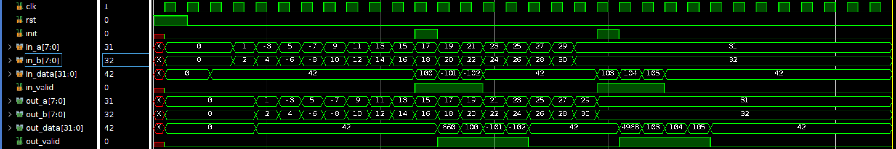

PE simulation accepts an argument `FIRST` (default value `FIRST=0`). When `FIRST=1`, the testbench treats the PE as if it were the first in the row, and doesn't offer valid `in_data` coming from the left to the PE.

Below is the expected output of running `make pe-xsim FIRST=1`. Successful completion of the test should show "PASSED!" message.

```txt
# Time=0 | rst=1 | init=0 | in_a=0 | in_b=0 | out_a=0 | out_b=0 | in_data=0 | in_valid=0 | out_data=0 | out_valid=0
# Time=0 | rst=0 | init=0 | in_a=0 | in_b=0 | out_a=0 | out_b=0 | in_data=0 | in_valid=0 | out_data=0 | out_valid=0
# Time=1 | rst=0 | init=0 | in_a=0 | in_b=0 | out_a=0 | out_b=0 | in_data=42 | in_valid=0 | out_data=0 | out_valid=0
# Time=2 | rst=0 | init=0 | in_a=1 | in_b=2 | out_a=0 | out_b=0 | in_data=42 | in_valid=0 | out_data=0 | out_valid=0
# Time=3 | rst=0 | init=0 | in_a=-3 | in_b=4 | out_a=1 | out_b=2 | in_data=42 | in_valid=0 | out_data=42 | out_valid=0
# Time=4 | rst=0 | init=0 | in_a=5 | in_b=-6 | out_a=-3 | out_b=4 | in_data=42 | in_valid=0 | out_data=42 | out_valid=0
# Time=5 | rst=0 | init=0 | in_a=-7 | in_b=-8 | out_a=5 | out_b=-6 | in_data=42 | in_valid=0 | out_data=42 | out_valid=0
# Time=6 | rst=0 | init=0 | in_a=9 | in_b=10 | out_a=-7 | out_b=-8 | in_data=42 | in_valid=0 | out_data=42 | out_valid=0
# Time=7 | rst=0 | init=0 | in_a=11 | in_b=12 | out_a=9 | out_b=10 | in_data=42 | in_valid=0 | out_data=42 | out_valid=0
# Time=8 | rst=0 | init=0 | in_a=13 | in_b=14 | out_a=11 | out_b=12 | in_data=42 | in_valid=0 | out_data=42 | out_valid=0
# Time=9 | rst=0 | init=0 | in_a=15 | in_b=16 | out_a=13 | out_b=14 | in_data=42 | in_valid=0 | out_data=42 | out_valid=0
# Time=10 | rst=0 | init=1 | in_a=17 | in_b=18 | out_a=15 | out_b=16 | in_data=42 | in_valid=0 | out_data=42 | out_valid=0
# Time=11 | rst=0 | init=0 | in_a=19 | in_b=20 | out_a=17 | out_b=18 | in_data=42 | in_valid=0 | out_data=660 | out_valid=1
# Time=12 | rst=0 | init=0 | in_a=21 | in_b=22 | out_a=19 | out_b=20 | in_data=42 | in_valid=0 | out_data=42 | out_valid=0
# Time=13 | rst=0 | init=0 | in_a=23 | in_b=24 | out_a=21 | out_b=22 | in_data=42 | in_valid=0 | out_data=42 | out_valid=0
# Time=14 | rst=0 | init=0 | in_a=25 | in_b=26 | out_a=23 | out_b=24 | in_data=42 | in_valid=0 | out_data=42 | out_valid=0
# Time=15 | rst=0 | init=0 | in_a=27 | in_b=28 | out_a=25 | out_b=26 | in_data=42 | in_valid=0 | out_data=42 | out_valid=0
# Time=16 | rst=0 | init=0 | in_a=29 | in_b=30 | out_a=27 | out_b=28 | in_data=42 | in_valid=0 | out_data=42 | out_valid=0
# Time=17 | rst=0 | init=0 | in_a=31 | in_b=32 | out_a=29 | out_b=30 | in_data=42 | in_valid=0 | out_data=42 | out_valid=0
# Time=18 | rst=0 | init=1 | in_a=31 | in_b=32 | out_a=31 | out_b=32 | in_data=42 | in_valid=0 | out_data=42 | out_valid=0
# Time=19 | rst=0 | init=0 | in_a=31 | in_b=32 | out_a=31 | out_b=32 | in_data=42 | in_valid=0 | out_data=4968 | out_valid=1
# Time=20 | rst=0 | init=0 | in_a=31 | in_b=32 | out_a=31 | out_b=32 | in_data=42 | in_valid=0 | out_data=42 | out_valid=0
# Time=21 | rst=0 | init=0 | in_a=31 | in_b=32 | out_a=31 | out_b=32 | in_data=42 | in_valid=0 | out_data=42 | out_valid=0
# Time=22 | rst=0 | init=0 | in_a=31 | in_b=32 | out_a=31 | out_b=32 | in_data=42 | in_valid=0 | out_data=42 | out_valid=0
# Time=23 | rst=0 | init=0 | in_a=31 | in_b=32 | out_a=31 | out_b=32 | in_data=42 | in_valid=0 | out_data=42 | out_valid=0
# Time=24 | rst=0 | init=0 | in_a=31 | in_b=32 | out_a=31 | out_b=32 | in_data=42 | in_valid=0 | out_data=42 | out_valid=0
# Time=25 | rst=0 | init=0 | in_a=31 | in_b=32 | out_a=31 | out_b=32 | in_data=42 | in_valid=0 | out_data=42 | out_valid=0
# Time=26 | rst=0 | init=0 | in_a=31 | in_b=32 | out_a=31 | out_b=32 | in_data=42 | in_valid=0 | out_data=42 | out_valid=0
# Time=27 | rst=0 | init=0 | in_a=31 | in_b=32 | out_a=31 | out_b=32 | in_data=42 | in_valid=0 | out_data=42 | out_valid=0
# Time=28 | rst=0 | init=0 | in_a=31 | in_b=32 | out_a=31 | out_b=32 | in_data=42 | in_valid=0 | out_data=42 | out_valid=0
# Time=29 | rst=0 | init=0 | in_a=31 | in_b=32 | out_a=31 | out_b=32 | in_data=42 | in_valid=0 | out_data=42 | out_valid=0
# Time=30 | rst=0 | init=0 | in_a=31 | in_b=32 | out_a=31 | out_b=32 | in_data=42 | in_valid=0 | out_data=42 | out_valid=0

--
PASSED!
--
```

When you run `make pe-xsim FIRST=1 GUI=1` to launch xsim in GUI mode, below is the expected waveform.

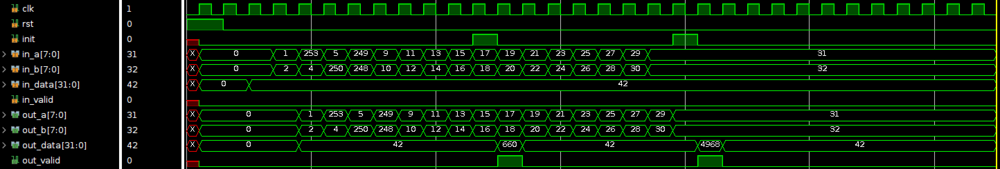

#### Expected Simulation Output for Systolic Module

Below is the expected output of running `make systolic-xsim M=8 N=4, or make systolic-run M=8 N=4`. Successful completion of the test should show "Thank Mr. Goose!" message.

```txt
Matrix A is:
[[ 0 -5 -2 -2  2  4 -2  0]
 [-3 -1  2  1  3  3 -4  1]
 [ 2  2  3 -4  0  4  3  4]
 [-1 -2 -5 -2  0 -5 -3 -2]
 [ 3 -4 -2 -2 -2  2 -5 -4]
 [ 4  4 -5 -1  2 -2 -3  2]
 [-3 -5 -5 -1  0  0  1  3]
 [-1 -4 -1  4  3 -4 -4  2]]

Matrix B is:
[[ 4  4 -2  1  2 -3 -5 -2]
 [ 0  4 -1 -1  1 -1 -1 -2]
 [-1 -1  3 -1 -2  2  0  0]
 [-5 -4  0  4 -2 -5  0 -5]
 [-4 -3 -1 -3 -5 -2 -3 -5]
 [ 2  0  4 -5 -3  2 -3  4]
 [-3 -2 -2 -3 -2 -1 -4 -3]
 [ 4 -4 -1  1  3 -3 -2 -5]]

True Answer is:
[[ 18 -12  17 -21 -15  17  -5  32]
 [ -9 -27  29 -11 -26  10  12   7]
 [ 40   7   9 -44   2  11 -44  -1]
 [  2  15 -23  30  25   4  38  15]
 [ 35  38  16   8  12  26  17  65]
 [ 31  33 -33  16  32 -32 -16 -30]
 [  7 -37  -9   3   8  -1  10   3]
 [-23 -44 -10  45  -1 -31  24 -39]]

Your Answer is:
[[ 18 -12  17 -21 -15  17  -5  32]
 [ -9 -27  29 -11 -26  10  12   7]
 [ 40   7   9 -44   2  11 -44  -1]
 [  2  15 -23  30  25   4  38  15]
 [ 35  38  16   8  12  26  17  65]
 [ 31  33 -33  16  32 -32 -16 -30]
 [  7 -37  -9   3   8  -1  10   3]
 [-23 -44 -10  45  -1 -31  24 -39]]

##########

                                   ___
                               ,-""   `.
       Thank Mr. Goose       ,'  _   ' )`-._
                            /  ,' `-._<.===-'
                           /  /
                          /  ;
              _          /   ;
 (`._    _.-"" ""--..__,'    |
 <_  `-""                     \
  <`-                          :
   (__   <__.                  ;
     `-.   '-.__.      _.'    /
        \      `-.__,-'    _,'
         `._    ,    /__,-'
            ""._\__,'< <____
                 | |  `----.`.
                 | |        \ `.
                 ; |___      \-``
                 \   --<
                  `.`.<
                    `-'
                    

##########
```

When you run `make systolic-xsim M=8 N=4 GUI=1` to launch xsim in GUI mode, below is the expected waveform.Note that matrix values get filled with random data from python every simulation. For debugging purposes, you can set DEBUG=1 parameter to fill the matrices with uniform incrementing pattern {0,1,2,3,...,N} where N is the size of the matrix. i.e. `make systolic-xsim M=8 N=4 DEBUG=1` 

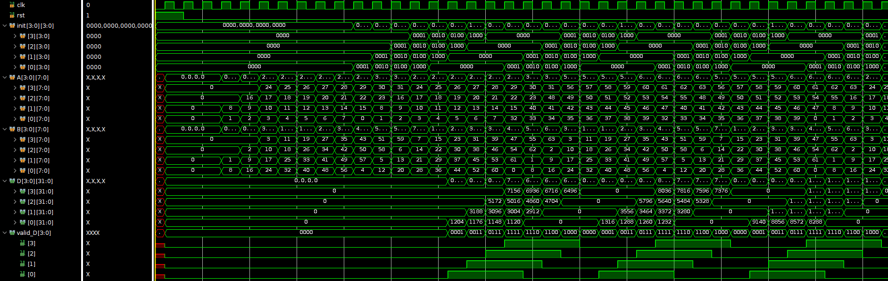

You can also run `make systolic-xsim M1=<value1> M2=<value2> M3=<value3> N1=<value4> N2=<value5>` by replacing `<value1/2/3/4/5>` with the values you wish to use.
Make sure you pass all the combinations that are used for grading (see Grading section below).

you can also use verilator, as:
```zsh
make systolic-run M=8 N=4
gtkwave systolic.vcd
```
#### Expected Simulation Output for Address Generator Modules

Successful completion of the tests should show "PASSED!" message.
For each address generation unit, you can test the following combinations: `M=4 N=4`, `M=8 N=4`, `M1=32 M2=16 M3=8 N1=8 N2=4`.

When you run `make write-a-xsim M=8 N=4 GUI=1` to launch xsim in GUI mode, below is the expected waveform.

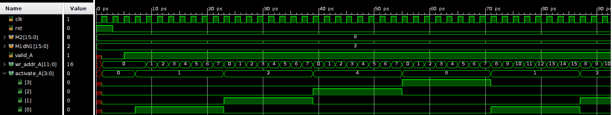

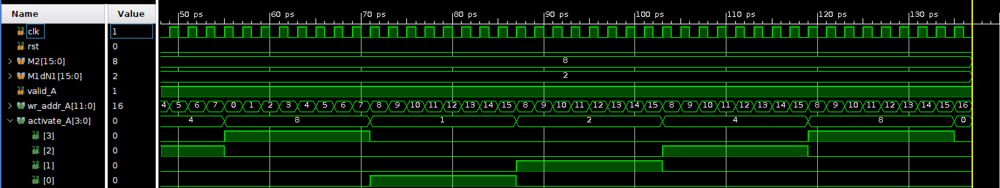

When you run `make write-b-xsim M=8 N=4 GUI=1` to launch xsim in GUI mode, below is the expected waveform.

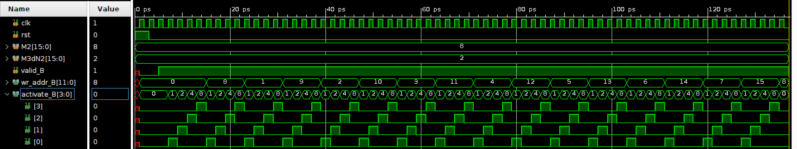

When you run `make read-d-xsim M=8 N=4 GUI=1` to launch xsim in GUI mode, below is the expected waveform.

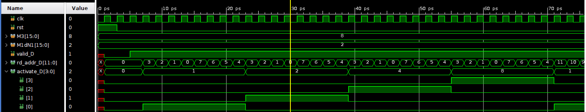

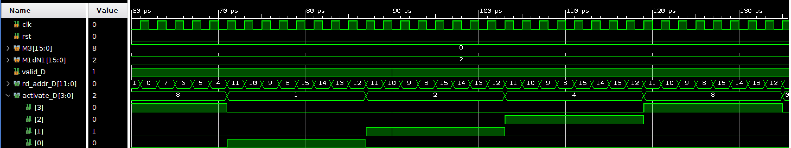

When you run `make write-b-xsim M=16 N=4 BLOCKS=2 GUI=1` to launch xsim in GUI mode, below is the expected waveform.

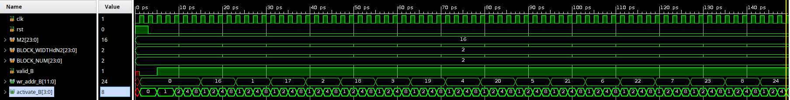

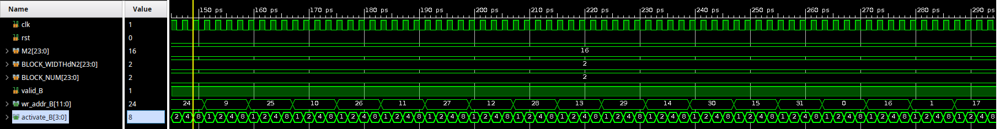

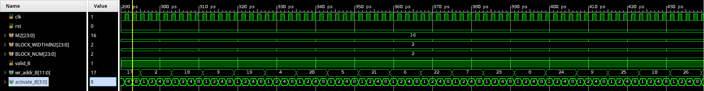

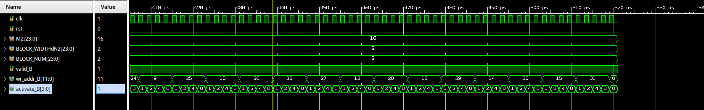

When you run `make read-d-xsim M=16 N=4 BLOCKS=2 GUI=1` to launch xsim in GUI mode, below is the expected waveform.

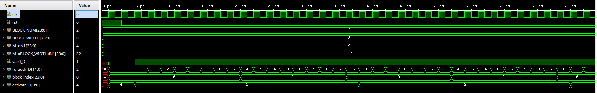

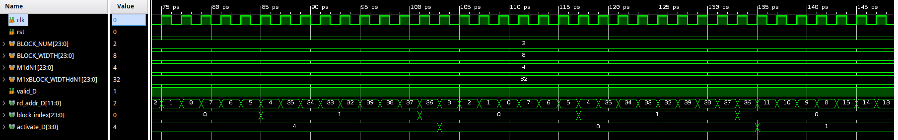


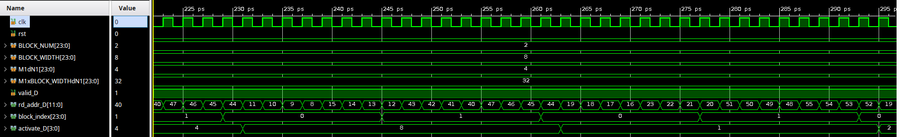


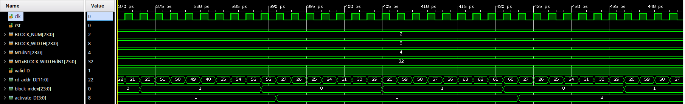

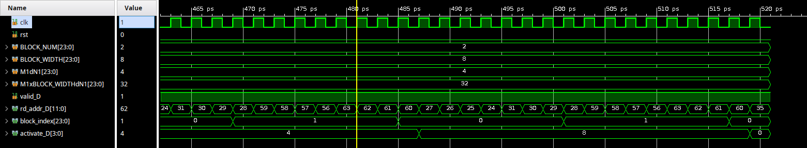

## Synthesis

To synthesize a module using `vivado`, simply type:

```zsh
make pe-synth
make systolic-synth N1=8 N2=4
```

Vivado will run synthesis step for the specified module.
If synthesis is successful, Vivado will save the post-synthesis module as `pe_synth.sv` /  `systolic_synth.sv` file.
Watch out for any error messages printed by Vivado during synthesis.

After successful completion of the synthesis step, you can run **post-synthesis simulation**:

```zsh
make pe-synth-xsim
```

You can also test synthesized systolic module with different `M1`, `M2`, and `M3` values, but make sure to provide `N1=8` and `N2=4` (these values are hardcoded for post-synth simulation):

```zsh
make systolic-synth-xsim M1=8 M2=16 M3=8 N1=8 N2=4
```

Similar to the previous simulation step, successful completion of the post-synthesis simulation test should show "PASSED!" / "Thank Mr. Goose!" messages.

To synthesize an address generation unit, specify `DUT` with the module name (`MEM_A`, `MEM_B`, `MEM_D`):

```zsh
make addr-synth N1=4 N2=4 DUT=MEM_A
```

Run post-synth simulation:

```zsh
make addr-xsim M=8 N1=4 N2=4 DUT=MEM_A MODE=synth
```

For address generation units (`MEM_B_pp`, `MEM_D_pp`), use the same commands with `BLOCKS=number` argument.

## Implementation

To run the implementation step for a module using `vivado`, simply type:

```zsh
make pe-impl
make systolic-impl N1=8 N2=4
```

Vivado will run the implementation step for the specified module.
After completion of the implementation step, modules will be placed and routed.
Output module will be saved (post-place-and-route module) as `pe_impl.sv` /  `systolic_impl.sv` file.
Watch out for any error messages printed by Vivado during implementation.

After completion of the implementation step, you can run **post-implementation simulation** with diferent parameters, but make sure to provide `N1=8` and `N2=4` (these values are hardcoded for post-impl simulation):

```zsh
make pe-impl-xsim
make systolic-impl-xsim M1=8 M2=16 M3=8 N1=8 N2=4
```

For address generation units (`MEM_A`, `MEM_B`, `MEM_D`):

```zsh
make addr-impl N1=4 N2=4 DUT=MEM_A
make addr-xsim M=8 N1=4 N2=4 DUT=MEM_A MODE=impl
```
For address generation units (`MEM_B_pp`, `MEM_D_pp`), use the same commands with `BLOCKS=number` argument.

## Board Deployment

To run the design on the board, you will need to do the following four steps:

1. Generate FPGA bitstream [on the `eceubuntu` server].
2. Transfer files and run python test on the ARM CPU of the _Pynq_ board [on the `eceubuntu` server].

**Step 1.** To generate the bitstream with the systolic array dimensions N1xN2, run the following commands on the `eceubuntu` server:

```zsh
make bitstream N1=4 N2=4
```
Add `BLOCKS` parameter if needed. This might take 15-20 minutes. If the process finishes with no errors, `vivado` will generate `*.hwh` and `*.bit` files in `overlay` folder.

**Step 2.** Once the bitstream files are generated succesfully, you need to copy them to the _PYNQ_ board. Check the connection with the _PYNQ_ board:

```zsh
make ping-board
```

Successful connection should show that all transmitted packets were received: `0% packet loss`.

Finally, to test your design on the board using provided python script `board.py`, simply type:

```zsh
make run-board M1=4 M2=8 M3=4 N1=4 N2=4
```

This step automatically transfers files, ssh to the board, and runs the test script. It will prompt for a password, which is *xilinx*. If the default board 02 is busy, you could edit the Makefile's PYNQ_IP to access any of the boards 01-10. 

Successful completion of the test should show "Thank Mr. Goose!" message.

Make sure to use the same `N1` and `N2` that you have used to generate bitstreams. You can try to run the test with different `M1`. `M2`, and `M3` combinations.

**NOTE:** To check different `N1` and `N2` combinations, you have to repeat all 2 steps above: go back to the `eceubuntu` server and generate corresponding bitstreams by supplying necessary `N1` and `N2` values (Step-1); then copy them onto the lab machine and run the test on the board (Step-2).

#### Understanding Timing Simulations

You *may* have a scenario where your design works fine in the simulation. However it does not work in hardware.

There are three steps to diagnosing the fault.

**Step 1.** First, try to simulate the design with our provided `mm.sv` wrappers. This will ensure that you are interfacing with our framework correctly (you can switch around M1/M2/M3/N1/N2 values to suit your debug needs):

```zsh
make mm-xsim M1=4 M2=8 M3=4 N1=4 N2=4
```

**Step 2.** Next, if that works, and your design still behaves oddly when mapped to hardware, you will need to try post-synthesis simulation. First, synthesize your design with our wrapper `mm.sv`:

```zsh
make mm-synth N1=4 N2=4
```

Next, run post-synthesis simulation (make sure to use the same `N1` and `N2` values from the synthesis step):

```zsh
make mm-synth-xsim M1=4 M2=8 M3=4 N1=4 N2=4
```

This will run Vivado until the `synth_design` step.
This is adequate for detecting simple RTL coding style bugs that result in incorrect hardware generation.
The netlist contains LUTs, FFs, DSPs, BRAMs, and other FPGA components.
Each component has a Verilog simulation model with detailed timing information.

**Step 3.** Finally, if the board execution still fails, check post-implementation simulation:

```zsh
make mm-impl N1=4 N2=4
make mm-impl-xsim M1=4 M2=8 M3=4 N1=4 N2=4
```

When running post-implementation simulation, the final mapped (placed-and-routed) design elements are simulated.

If you encounter errors, in one of the post-synthesis or post-implementation simulations, you can try adjusting the `clk` and `fclk` periods when `XIL_TIMING` is true inside `mm_tb.sv` file. In the code block below, change 50000 and 20000 to larger numbers. Other errors are likely a bug in your Verilog code.

```verilog
...
`ifndef XIL_TIMING
always #10000 clk = ~clk;
always #4000 fclk = ~fclk;
`else
always #50000 clk = ~clk;
always #20000 fclk = ~fclk;
`endif
```

**Interesting Information:** You may be piqued to know that this design
operates off two clocks i.e. has two clock domains.
One clock is for the write interface of `s2mm.sv` and the read interface of `mm2s.sv`. This allows the wrapper logic that feeds data to/from the CPU to operate at a lower clock
frequency. This is fine because the data loading times are smaller than data
computing times inside the `systolic.sv` core. This is particular true when
we have data reuse for neural network computations. We isolate the faster
clock fclk to drive `systolic.sv`, the read interface of `s2mm.sv` that
feeds data into the systolic core, and write interface `mm2s.sv` that dumps
resulting data into the output memories. Thus, you are free to optimize
fclk without the baggage of peripheral logic that you did not write.
Furthermore, clock crossings typically need special care through the use of
dual-rank synchronizers which you can find them on start_multiply and
done_multiply signals if you are curious. Luckily the BRAM primitive
naturally supports clock isolation between two clock domains by permitting
separate read and write clocks to the RAM.

## Grading

There are two parts in the grading procedure.

#### Part 1

To grade your code for Part 1, just type:

For 327 students:

```zsh
make grade_327 USE_BOARD=0
```

For 627 students:

```zsh
make grade_627 USE_BOARD=0
```

This grade rule will run `grade_327/627.sh` script and fill in `grade.csv` file with your marks for Part 1:
- 4 points of the lab grade will be reserved for passing `make pe-xsim`: 2 points for `FIRST=0` and 2 points for `FIRST=1`. The script will check for the absence of "Error" messages and the presence of a "PASSED!" message in the simulation output.
- 8 points of the lab grade will be reserved for passing systolic simulation. 2 points for each of the following tests:

```zsh
make systolic-xsim M=4 N=4
make systolic-xsim M=8 N=4
make systolic-xsim M1=8 M2=16 M3=8 N=8
make systolic-xsim M1=8 M2=24 M3=8 N1=8 N2=4
```

- 18 points of the lab grade will be reserved for passing address generation units simulation. 2 points for each of the following tests, and for each `MEM_A`, `MEM_B`, and `MEM_D`:

```zsh
make addr-xsim M=4 N=4 DUT=MEM_A
make addr-xsim M=8 N=4 DUT=MEM_A
make addr-xsim M1=32 M2=16 M3=8 N1=8 N2=4 DUT=MEM_A
```

- 12 points of the lab grade will be reserved for passing address generation with double buffering units simulation. 2 points for each of the following tests, and for each `MEM_B_pp`, and `MEM_D_pp`:

```zsh
make addr-xsim M=4 N=4 DUT=MEM_B BLOCKS=2
make addr-xsim M=16 N=4 DUT=MEM_B BLOCKS=2
make addr-xsim M1=32 M2=768 M3=64 N1=8 N2=8 DUT=MEM_B BLOCKS=8
```

- 2 points of the lab grade will be reserved for passing `make pe-synth-xsim`. The script will check for the succesfull completion of the synthesis step, i.e., `pe_synth.sv` is present, and for correct post-synthesis simulation output.
- 5 points of the lab grade will be reserved for passing `make systolic-synth M1=8 M2=24 M3=8 N1=8 N2=4`. The script will check for the succesfull completion of the synthesis step, i.e., `systolic_synth.sv` is present, and for correct post-synthesis simulation output.
- 15 points of the lab grade will be reserved for passing post-synthesis simulation for address generation units: 5 points for each unit.
- 10 points of the lab grade will be reserved for passing post-synthesis simulation for address generation with double buffering units: 5 points for each unit.
- 4 points of the lab grade will be reserved for verilator lint generating no "Error" message: 2% for each module. The lint checks help guard against bad coding practices.

- 9 points of the lab grade will be reserved for resources utilization for `pe`, `systolic.sv`, `mem_A`, `mem_B` and `mem_D`. Your utilization should be within a tolerance to golden references.
- 4 points of the lab grade will be reserved for resources utilization for double `mem_write_B_pp` and `mem_read_D_pp`.
- 9 points of the lab grade will be reserved for meeting timing requirment with no setup or hold violations for `pe`, `systolic.sv`, `mem_A`, `mem_B` and `mem_D`.
- 4 points of the lab grade will be reserved for meeting timing requirment with no setup or hold violations for `mem_write_B_pp` and `mem_read_D_pp`.

**NOTE** you can set `USE_BOARD=1` if you the server is connected to the board and you want to test your entire design at one shot.

#### Part 2

Part 2 is reserved for checking your design on the board:
- 12 points of the lab grade will be reserved for passing timing constraints `make prep-board FOR_627=0`.
- 16 points of the lab grade will be reserved for passing tests on the board `make grade-board FOR_627=0`.

For grading and debuging, you must can execute the following commands:
```zsh
make prep-board #check that you are passing timing constraints

```
Now, move to the lab machine connected to the PYNQ board, launch MobaXterm and run the following commands inside your lab3 folder.

```zsh
make grade-board FOR_627=0
```
** If you are a 627, set `FOR_627` to 1. You should see 2 bitsreams tested. If you are a 327 student, you will see 1 bitstream.**

If you see a happy goose, and got full marks, things went OK and your bitstream
worked fine in real silicon!

Penalty for late submissions is 0% of the grade.

## Total Grade
ECE327: Max points you can get without double buffering address generators: **88**

ECE627: Max points you can get with double buffering address generators: **132**


## Submission

Go to the cloned git repository for Lab3.

Please fill in your solution code in `pe.sv`, `systolic.sv`, `mem_write_A.sv`, `mem_write_B.sv`, `mem_read_D.sv`, `mem_write_B_pp.sv`, and `mem_read_D_pp.sv`.

You can commit your design in two steps:
```
git commit -a -m "Yes we're tired, yes there's no relief, yes the Cylons keep coming and coming, and yes, we are still expected to do our labs! - Saul Tigh"
git push origin master
```

You may commit and push as many times as you want prior to submission deadline.
The most recently pushed commit prior to the deadline will be graded.
The contents of the commit message do not matter.

Frequently committing and pushing your code to the repository is recommended, so you can track your design progress over time under `Activity` tab on `git.uwaterloo.ca` in the browser.
