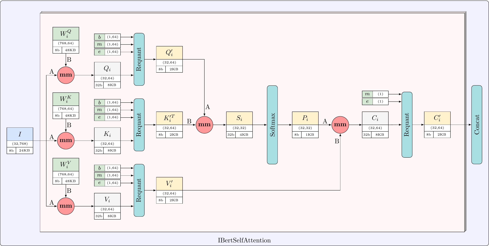

# LAB5: Constructing IBERT Model [Design, Simulation, Synthesis, Implementation]
## "Battle of Scariff", Rogue One

Deadline: 25th April 2025 09:00am!

## Getting started
First, clone the git repository onto your home directory on the `eceubuntu` lab server.

```zsh
mkdir -p $HOME/ece327-w25/labs
cd $HOME/ece327-w25/labs
git clone ist-git@git.uwaterloo.ca:ece327-w25/labs/v2sharda-lab5.git
```

Run the `env.sh` script to add relevant directories to your `PATH` and create a symbolic link to lab data.
```zsh
cd v2sharda-lab5/
source env.sh
```

## Lab Objectives

The objective of the fifth lab is to construct the whole IBERT Language Model and run it on the _PYNQ_ board. Specifically, you will design the following modules:

* `attn_head.sv` - Self-Attention Head module that computes Q - query, K - key, and V - value matrices, chained with softmax to find self-attention result.
* `mm_ln.sv` - **MM + LayerNorm** module that computes `out = layer_norm((X * W + W_bias) + R)`.
* `mm_gelu.sv` - **MM + GELU** module that computes `out = gelu(A * W + W_bias)`.

## Design

This is a high-level picture of the IBERT model below:


Each rectangle contains information about a matrix: e.g., `I` - name, `(32,768)` dimension, `8b` - precision, `24KB` - memory size.

In this lab, you will build the model above by wiring the components from previous labs together. To do that, you will design **Attention Head**, **MM + LayerNorm**, and **MM + GELU** modules described below.

#### AXI Bundles

In this lab, we provide several inputs and outputs as AXI bundles.
An AXI bundle is a commonly-used group of signals that form an interface between two modules.
Instead of passing each signal individually, we can group them into this structured interface to simplify the connections.
For this lab, the AXI bundle consists of the following ports, defined in `axi_stream_if.sv`:

* `tdata` : `D_W` bits, the data being transferred.
* `tlast` : 1 bit, indicates that the `tdata` in a given cycle is the last to be transmitted.
* `tvalid` : 1 bit, indicates that `tdata` has valid data.
* `tready` : 1 bit, indicates that the other module is ready to receive `tdata`.

You will see these bundles used as ports for some of the modules in Lab 5.
An AXI bundle may be declared as an `axi_in` port or an `axi_out` port.
An `axi_in` port corresponds to `tdata`, `tlast`, and `tvalid` acting as inputs to the module with `tready` acting as an output.
An `axi_out` port corresponds to `tdata`, `tlast`, and `tvalid` acting as outputs from the module with `tready` acting as an input.
You will not need to declare any new AXI ports, but you may find this information useful to help wire up the lab components.

#### Using Lab 3 and Lab 4 Solution Code

If you did not get the systolic module working in Lab 3 or the softmax or layer norm modules working in Lab 4, you can use post-synthesis versions of the solution code for each module.
You can use `*_func_sol.sv` for functional simulation with Verilator or `*_synth_sol.sv` for synthesis, implementation, or to generate a bitstream.
Use the following procedure to incorporate them into your design:

1. If you use any of the solution files, you must clone the unisims library. This repo contains supplementary verilog files needed to simulate with the post-synthesis module(s) in Verilator.
```zsh
git clone ist-git@git.uwaterloo.ca:ece327-w25/labs-admin/unisims.git
cp -r $HOME/ece327-w25/labs/unisims $HOME/ece327-w25/labs/v2sharda-lab5/
```

2. The Makefile calls a script that automatically copies the code for the necessary files if you choose to use the solution code. There is no need to manually copy or comment out any code.

3. When running commands with `make`, you can choose which solution modules to use with `USE_SYNTH_SYSTOLIC`, `USE_SYNTH_LN`, and `USE_SYNTH_SOFTMAX`. We also provide the flag `USE_SYNTH` which uses all available solution modules. The following example runs a verilator simulation for `mm_ln` using the solution modules for systolic and layer norm.
```zsh
make mm_ln_tb.sv M1=32 M2=768 M3=768 BLOCKS=192 USE_SYNTH_LN=1 USE_SYNTH_SYSTOLIC=1
```

4. For grading, you will need to set your preferred values for each of the above flags in `synth_config.sh`. We will refer to this file when grading. For example, the following informs us to use the solution code for systolic and layer norm, but not softmax.
```zsh
USE_SYNTH_SYSTOLIC=1
USE_SYNTH_SOFTMAX=0
USE_SYNTH_LN=1
```


### Attention Head Module

Python implementation of the attention head is given in `attn_head.py`:

```python
def requant(qin: np.int32, bias: np.int32, m: np.int32, e: np.int8) -> np.int8:
    '''
        qin - int32, input
        bias - int32, bias data
        m - int32, requantization multiplier
        e - int8, requantization shifter
        qout - int8, output
    '''
    qbias = qin + bias                  # int32
    qm = np.int64(qbias) * m            # int64
    qout = np.round(qm * 2.0**(-e))     # int8
    qout = np.int8(qout)
    return qout


def attn_head(I: np.int8, Qw: np.int8, Kw: np.int8, Vw: np.int8,
                     Qb: np.int32, Kb: np.int32, Vb: np.int32,
                     Qm: np.int32, Km: np.int32, Vm: np.int32,
                     Qe: np.int8, Ke: np.int8, Ve: np.int8, 
                     Cm: np.int32, Ce: np.int8) -> np.int8:
    '''
        I - int8, (32,768), input
        Qw, Kw, Vw - int8, (768,64), weights
        Qb, Kb, Vb - int32, (1,64), bias
        Qm, Km, Vm - int32, (1,64), requantization multiplier
        Qe, Ke, Ve - int8, (1,64), requantization shifter
        Cm - int32, (1), requantization multiplier
        Ce - int8, (1), requantization shifter
        qout - int8, output
    '''
    I_Q = np.matmul(I, Qw, dtype=np.int32)
    I_K = np.matmul(I, Kw, dtype=np.int32)
    I_V = np.matmul(I, Vw, dtype=np.int32)

    Q_8 = requant(I_Q, bias=Qb, m=Qm, e=Qe)
    K_8 = requant(I_K, bias=Kb, m=Km, e=Ke)
    V_8 = requant(I_V, bias=Vb, m=Vm, e=Ve)

    S = np.matmul(Q_8, K_8.T, dtype=np.int32)
    P = softmax(qin=S, qb=np.int32(1874), qc=np.int32(1338211),
                qln2=np.int32(-480), qln2_inv=np.int32(-2236963),
                Sreq=np.int32(26291085), fp_bits=30, max_bits=30, out_bits=6)
    C_32 = np.matmul(P, V_8, dtype=np.int32)
    C_8 = requant(C_32, bias=0, m=Cm, e=Ce)
    return C_8
```

Diagram of the Attention head modules is given below.

NOTE: Given diagram is for reference only, and may omit some of the details needed for actual hardware.



The following are the parameters of the `attn_head.sv` module:

* `D_W` : data width of the inputs.
* `D_W_ACC` : data width of the accumulator.
* `N1` : number of rows of the systolic array.
* `N2` : number of columns of the systolic array.
* `LAYERS` : number of layers.
* `SOFTMAX_N` : number of elements per row for softmax.
* `MATRIXSIZE_W` : number of bits required to hold the M1/2/3 matrix size parameters.
* `MEM_DEPTH_A`: depth of the memory banks that stores matrix A for `mm`.
* `MEM_DEPTH_B`: depth of the memory banks that stores matrix B for `mm`.
* `MEM_DEPTH_D`: depth of the memory banks that stores matrix D for `mm`.
* `REQ_MEM_DEPTH`: depth of the memory banks that store bias and requantization vectors.

The following are the I/O ports of the `attn_head.sv` module:

* `clk` : 1 bit input : This is the clock input to the module.
* `fclk` : 1 bit input : This is the fast clock input to the module.
* `rst` : 1 bit input : This is a synchronous reset signal.
* `in_I` : AXI bundle, 32 bit data input : streaming input for matrix $I$.
* `in_W_{Q/K/V}` : AXI bundle, 32 bit data input : streaming input port for weights $W_Q$, $W_K$, and $W_V$, respectively.
* `in_bias_{Q/K/V}` : AXI bundle, 32 bit data input : streaming input port for bias.
* `in_m_{Q/K/V}` : AXI bundle, 32 bit data input : streaming input port requantization m.
* `in_e_{Q/K/V}` : AXI bundle, 32 bit data input : streaming input port requantization e.
* `attn_head_out` : AXI bundle, 32 bit data output : streaming output of attention head - matrix $C'$ goes out from this port.
* `mm_dimensions` : packed struct that contains matrix dimensions.

Description:

* You will need to appropriately stitch the submodules together in `attn_head.sv` through AXI bundles to build the attention head module as shown in the figure above.
* Copy your solutions from the previous labs for the following modules: `systolic.sv`, `pe.sv`, `mem_write_A.sv`, `mem_write_B.sv`, and `mem_read_D.sv`.
* For matrix multiplication, we will use `mm.sv`, a wrapper of `systolic.sv` that contains memory banks to store input and output matrices.
* We use three `mm` modules to calculate $Q=I \times W_Q$, $K=I \times W_K$, $V=I \times W_V$, $Q \times K^T$, and $P * V$. The first three multiplication operations share a single multiplier.
* Make sure to correctly connect the ports `A` and `B` to match the diagram.
* You also need to provide correct dimensions to each `mm` instance. Top module parameter values are `M1=32`, `M2=768`, `M3=64`, they are supplied for the three `mm` that compute multiplication with weights, you should find out dimensions for the other two `mm` using these `M` parameters and by looking at the attention block diagram as a reference. You can access dimension parameters, e.g., `M1`, `M2`, from `mm_dimensions` struct, e.g., `mm_dimensions.M1`. Pay close attention to how dimensions should be shuffled when you do transpose for $S=Q \times K^T$. Look at `dims.sv` for all the available dimension parameters. You may find some hints in this file.
* Default values: M1=32, M2=768, M3=64. These are also the values shown in the diagram. It means three mm modules that compute multiplications of input matrix I (M1,M2) and weights (M2,M3) should get these dimensions. Let's look at the next mm instance. It calculates Q*K^T. What are the dimensions for this matmul? Q = I * W_Q, which means we're multiplying matrix I (M1,M2) by matrix W_Q (M2,M3) and this results in (M1,M3) output. Thus, Q has dimensions of (M1,M3), i.e., (32,64).
* Same for K, it's (M1,M3), and note that you're doing transpose here, which means K^T has a dimension of (M3,M1). Q*K^T mm should then compute matmul of (M1,M3) by (M3,M1), resulting in (M1,M1) matrix. Do similar calculations for the last mm.
* Note that you need to provide parameter `TRANSPOSE_B=1` to the `mm` instance that calculates $S=Q \times K^T$.
* Another important parameter is `MEM_DEPTH_*` which needs to be supplied to every `mm` to store A, B, and D matrices. Note that not all of the `mm` should get the same memory depths. Hint: by analyzing the diagram you need to decide which `MEM_DEPTH` parameter should be supplied to the last two `mm` modules that compute `S` and `C`.
* Information about memory depths: `MEM_DEPTH_A := M1*M2/N1`, `MEM_DEPTH_B := M2*M3/N2`, `MEM_DEPTH_D := M1*M3/N1`, `MEM_DEPTH_S := M1*M1/N1`. Each parameter indicates the depth of the memory bank required to hold matrix data of given dimensions. For each mm.sv file you have to determine three parameters for inputs A, B and output D.  For example, MEM_DEPTH_A should be passed to mm that calculate I*W_Q as MEM_DEPTH_A to hold matrix I which has a dimension of (M1,M2), i.e. .MEM_DEPTH_A(MEM_DEPTH_A), in the instance. MEM_DEPTH_S should be passed to mm that calculates Q*K^T as MEM_DEPTH_D to hold matrix S which has a dimensions of (M1,M1), and so on, i.e. .MEM_DEPTH_D(MEM_DEPTH_S), in the instance.

### MM + LayerNorm Module

Python implementation of the module is given in `modeling_ibert.py`:

```python
def output(X: np.int8, W: np.int8, R: np.int8,
           W_bias: np.int32, W_m: np.int32, W_e: np.int8,
           R_m: np.int32, R_e: np.int8,
           out_m: np.int32, out_e: np.int8,
           ln_bias: np.int32, ln_bits: int=22) -> np.int8:
    '''
        X - int8, (32,768) or (32,3072), input
        W - int8, (3072,768) or (768,768), weight
        R - int8, (32,768), residual input for matrix addition
        W_bias - int32, (1,768), bias
        W_m, out_m - int32, (1,768), requantization multiplier
        W_e, out_e - int8, (1,768), requantization shifter
        R_m - int32, (1), requantization multiplier
        R_e - int8, (1), requantization shifter
        out - int8, (32,768), output
    '''
    ln_range = 2 ** (ln_bits - 1) - 1
    Y = np.matmul(X, W, dtype=np.int32)
    Y_req = requant(qin=Y, bias=W_bias, m=W_m, e=W_e, out_bits=32, clip=False)
    R_req = requant(qin=R, bias=0, m=R_m, e=R_e, out_bits=32, clip=False)
    Z = Y_req + R_req
    Z = np.clip(Z, -ln_range-1, ln_range)
    ln_out = layer_norm(qin=Z, bias=ln_bias, shift=6,
                        n_inv=1398101, max_bits=31, fp_bits=30)
    out = requant(ln_out, bias=0, m=out_m, e=out_e, out_bits=8)
    return out
```

Diagram of the MM + LayerNorm module is given below.

NOTE: Given diagram is for reference only, and may omit some of the details needed for actual hardware.


This mm_ln module is reused for two stages of IBERT: IBertSelfOutput (self-out) and IBertOutput (layer-out). Note that these two stages have different matrix dimensions.

self-out |  layer-out
:----:|:----:
 |  |

The following are the parameters of the `mm_ln.sv` module:

* `D_W` : data width of the inputs.
* `D_W_ACC` : data width of the accumulator.
* `LN_BITS` : number of bits for layer_norm input matrix.
* `N1` : number of rows of the systolic array.
* `N2` : number of columns of the systolic array.
* `MATRIXSIZE_W` : number of bits required to hold the M1/2/3 matrix size parameters.
* `MEM_DEPTH_A`: depth of the memory banks that stores matrix A for `mm`.
* `MEM_DEPTH_B`: depth of the memory banks that stores matrix B for `mm`.
* `MEM_DEPTH_D`: depth of the memory banks that stores matrix D for `mm`.
* `MAT_ADD_MEM_DEPTH`: depth of the memory that stores residual matrix R for matrix addition.
* `REQ_MEM_DEPTH`: depth of the memory banks that store bias and requantization vectors.

The following are the I/O ports of the `mm_ln.sv` module:

* `clk` : 1 bit input : This is the clock input to the module.
* `fclk` : 1 bit input : This is the fast clock input to the module.
* `rst` : 1 bit input : This is a synchronous reset signal.
* `in_X` : AXI bundle, 32 bit data input : streaming input data port for matrix $X$.
* `in_W` : AXI bundle, 32 bit data input : streaming input data port for weight $W$.
* `in_R` : AXI bundle, 32 bit data input : streaming input data port for residual matrix $R$.
* `in_W_bias` : AXI bundle, 32 bit data input : streaming input data port for bias.
* `in_W_m/e` : AXI bundle, 32 bit data input : streaming input data port for m/e values of $Y=XW$ requantization.
* `in_R_m/e` : AXI bundle, 32 bit data input : streaming input data port for m/e values of $R$ requantization.
* `in_ln_bias` : AXI bundle, 32 bit data input : streaming input data port for layer_norm bias.
* `in_out_m/e` : AXI bundle, 32 bit data input : streaming input data port for output requantization m/e.
* `mm_ln_out` : AXI bundle, 32 bit data output : streaming output data of mm_ln module.
* `mm_dimensions` : packed struct that contains matrix dimensions.

Description:

* You need to stitch together the module instantiations through AXIs to build the `mm_ln` module as shown in the figure above.
* Copy your solutions from the previous labs for the following modules: `systolic.sv`, `pe.sv`, `mem_write_A.sv`, `mem_write_B.sv`, and `mem_read_D.sv`.
* Instantiate one `mm` module to calculate $Y=XW$. $X$ should go as input A and $W$ as B to mm module.
* `mm` expects inverted clocks, so, you should invert `clk`, `fclk`, and `rst` when supplying them to `mm` instance. No inversion needed for other modules.
* There are three `requant` modules:
  1. `requant_Y` operates on the `mm` output $Y=XW$ and `W_bias`, `W_m`, and `W_e`, with `CLIP=0` and `OUT_BITS=D_W_ACC`
  2. `requant_R` requantizes the residual matrix $R$, with `CLIP=0` and `OUT_BITS=D_W_ACC`
  3. `requant_out` requantizes the `layer_norm` output with `out_m` and `out_e`, with `CLIP=1` and and `OUT_BITS=D_W`.
* The `mat_add` module calculates `Z = Y_req + R_req`. It has parameters: `MEM_DEPTH=MAT_ADD_MEM_DEPTH`, `MAX_BITS=LN_BITS`, `M1=mm_dimensions.M1`, `M2=mm_dimensions.M3`.
* `layer_norm_top` is a wrapper that instantiates your `layer_norm` module. It handles the AXI handshake with the module.

### MM + GELU Module

Python implementation of the module is given in `modeling_ibert.py`:

```python
def intermediate(A: np.int8, W: np.int8, W_bias: np.int32,
                 gelu_qb: np.int32, gelu_qc: np.int32, gelu_q1: np.int32,
                 out_m: np.int32, out_e: np.int8) -> np.int8:
    '''
        A - int8, (32,768), input
        W - int8, (768,3072), weight
        W_bias - int32, (1,3072), bias
        gelu_qb, gelu_qc, gelu_q1 - int32, (1), gelu coefficients
        out_m - int32, (1), requantization multiplier
        out_e - int8, (1), requantization shifter
        out - int8, (32,3072), output
    '''
    G = np.matmul(A, W, dtype=np.int32)
    # G = G + W_bias
    G = requant(qin=G, bias=W_bias, m=1, e=0, out_bits=32, clip=False)
    gelu_out = gelu(qin=G, qb=gelu_qb, qc=gelu_qc, q1=gelu_q1, shift=14)
    out = requant(gelu_out, bias=0, m=out_m, e=out_e, out_bits=8)
    return out
```

Diagram of the MM + GELU module is given below.

NOTE: Given diagram is for reference only, and may omit some of the details needed for actual hardware.


The following are the parameters of the `mm_gelu.sv` module:

* `D_W` : data width of the inputs.
* `D_W_ACC` : data width of the accumulator.
* `L` : number of layers.
* `N1` : number of rows of the systolic array.
* `N2` : number of columns of the systolic array.
* `MATRIXSIZE_W` : number of bits required to hold the M1/2/3 matrix size parameters.
* `MEM_DEPTH_A`: depth of the memory banks that stores matrix A for `mm`.
* `MEM_DEPTH_B`: depth of the memory banks that stores matrix B for `mm`.
* `MEM_DEPTH_D`: depth of the memory banks that stores matrix D for `mm`.
* `REQ_MEM_DEPTH`: depth of the memory banks that store bias and requantization vectors.

The following are the I/O ports of the `mm_gelu.sv` module:

* `clk` : 1 bit input : This is the clock input to the module.
* `fclk` : 1 bit input : This is the fast clock input to the module.
* `rst` : 1 bit input : This is a synchronous reset signal.
* `layer` : clog2(L) bits input : This is a model layer index.
* `in_A` : AXI bundle, 32 bit data input : streaming input data port for matrix $A$.
* `in_W` : AXI bundle, 32 bit data input : streaming input data port for weight $W$.
* `in_W_bias` : AXI bundle, 32 bit data input : streaming input data port for bias.
* `in_out_m/e` : AXI bundle, 32 bit data inputs : streaming input data port for output requantization m/e.
* `mm_gelu_out` : AXI bundle, `D_W` bit data output : streaming output data of mm_ln module.
* `mm_dimensions` : packed struct that contains matrix dimensions.

Description:

* The first `mm` module calculates $G=AW$. $A$ should go as input A and $W$ as B to mm module.
* There are two `requant` modules:
  1. `requant_G` operates on `mm` output $G=AW$ and `W_bias`, with `CLIP=0` and `OUT_BITS=D_W_ACC`
  2. `requant_out` requantizes the `gelu` output with `out_m` and `out_e`, with `CLIP=1` and and `OUT_BITS=D_W`.
* `gelu_top` is a wrapper to instantiate `gelu.sv`. It handles the AXI handshake with the module and stores gelu coefficients.

## Simulation

To compile and simulate a module using `verilator`, simply type one of the following:

```zsh
make attn_head_tb.sv M1=32 M2=768 M3=64 HEADS=12
make mm_ln_tb.sv M1=32 M2=768 M3=768 BLOCKS=192
make mm_gelu_tb.sv M1=32 M2=768 M3=3072 BLOCKS=96 BLOCKED_D=1
```

To generate traces for waveforms, run with `TRACE=1`.
Then, you can launch gtkwave GUI to see the waveforms:

```zsh
gtkwave attn_head.fst
gtkwave mm_ln.fst
gtkwave mm_gelu.fst
```

To test the IBERT model you can run:
```zsh
make ibert_axi_tb.sv BLOCKED_D=1
```

#### Expected Simulation Output for Attention Head Module

Successful completion of the tests should show "Thank Mr. Goose!" message.
First part of the output are produced by the $display statements from the testbench indicating which computation is being performed. The second part is produced by attn_head_test.py which compares saved output .mem files with the golden values.

```
Starting Attention Head Simulation...
Done Sending Q biases to Top Module at time=1310000
Done Sending K biases to Top Module at time=1310000
Done Sending V biases to Top Module at time=1310000
Done Sending Q M-vectors to Top Module at time=1310000
Done Sending K M-vectors to Top Module at time=1310000
Done Sending V M-vectors to Top Module at time=1310000
Done Sending Q E-vectors to Top Module at time=1310000
Done Sending K E-vectors to Top Module at time=1310000
Done Sending V E-vectors to Top Module at time=1310000
...
Done Sending I to Top Module at time=983070000
Done Sending Q weights to Top Module at time=983070000
Done Sending K weights to Top Module at time=983070000
Done Sending V weights to Top Module at time=983070000
...
Done computing Q=I*W_Q at time=1852090000
Done computing K=I*W_K at time=1852090000
Done computing V=I*W_V at time=1852090000
Done Requantizing Q at time=1852190000
Done Requantizing K at time=1852190000
Done Requantizing V at time=1852190000
Done computing S=Q*K at time=2000290000
Done computing P=softmax(S) at time=2003850000
...
Done computing C=P*V at time=215195000
...
##########
-- Q=I*W_Q Passed! :) -- 
-- Q Requantization Passed! :) -- 
-- K=I*W_K Passed! :) -- 
-- K Requantization Passed! :) -- 
-- V=I*W_V Passed! :) -- 
-- V Requantization Passed! :) -- 
-- S=Q*K Passed! :) -- 
-- P=softmax(S) Passed! :) -- 
-- C=P*V Passed! :) -- 
##########

##########

                                   ___
                               ,-""   `.
       Thank Mr. Goose       ,'  _   ' )`-._
                            /  ,' `-._<.===-'
                           /  /
                          /  ;
              _          /   ;
 (`._    _.-"" ""--..__,'    |
 <_  `-""                     \
  <`-                          :
   (__   <__.                  ;
     `-.   '-.__.      _.'    /
        \      `-.__,-'    _,'
         `._    ,    /__,-'
            ""._\__,'< <____
                 | |  `----.`.
                 | |        \ `.
                 ; |___      \-``
                 \   --<
                  `.`.<
                    `-'
                    

##########
```

#### Expected Simulation Output for MM + LN Module

Successful completion of the tests should show "Thank Mr. Goose!" message.

First part of the output are produced by the $display statements from the testbench indicating which computation is being performed. The second part is produced by `mm_ln_test.py` which compares saved output `.mem` files with the golden values.

```txt
Done Sending requantization shifter R_e to Top Module at time=3
Done Sending requantization multiplier R_m to Top Module at time=3
Done Sending requantization multiplier out_m to Top Module at time=769
Done Sending requantization shifter out_e to Top Module at time=769
Done Sending bias W_bias to Top Module at time=769
Done Sending requantization multiplier W_m to Top Module at time=769
Done Sending requantization shifter W_e to Top Module at time=769
Done Sending LayerNorm bias ln_bias to Top Module at time=769
Done Sending input X to Top Module at time=24577
Done Sending residual input R to Top Module at time=24577
Done computing R Requantization at time=24583
...
Done Sending weight W to Top Module at time=589825
...
Done computing Y=X*W at time=1794083
Done computing Y Requantization at time=1794088
Done computing matrix add Z = Y_req + R_req at time=1794090
Done computing LayerNorm at time=1794932
Done computing output at time=1794937
...
##########
-- Y=X*W Passed! :) -- 
-- Y Requantization Passed! :) -- 
-- R Requantization Passed! :) -- 
-- Z = Y_req + R_req Passed! :) -- 
-- layer_norm Passed! :) -- 
-- Good Job! mm_ln Output Requantization, Correct! :) -- 
##########
                                   ___
                               ,-""   `.
       Thank Mr. Goose       ,'  _   ' )`-._
                            /  ,' `-._<.===-'
                           /  /
                          /  ;
              _          /   ;
 (`._    _.-"" ""--..__,'    |
 <_  `-""                     \
  <`-                          :
   (__   <__.                  ;
     `-.   '-.__.      _.'    /
        \      `-.__,-'    _,'
         `._    ,    /__,-'
            ""._\__,'< <____
                 | |  `----.`.
                 | |        \ `.
                 ; |___      \-``
                 \   --<
                  `.`.<
                    `-'
##########
```

#### Expected Simulation Output for MM + GELU Module

Successful completion of the tests should show "Thank Mr. Goose!" message.

First part of the output are produced by the $display statements from the testbench indicating which computation is being performed. The second part is produced by `mm_gelu_test.py` which compares saved output `.mem` files with the golden values.

```txt
Done Sending requantization shifter out_e to Top Module at time=3
Done Sending requantization multiplier out_m to Top Module at time=3
Done Sending bias W_bias to Top Module at time=3073
Done Sending input A to Top Module at time=24577
...
Done Sending weight W to Top Module at time=2359297
...
Done computing G=A*W at time=7176227
Done computing G Requantization at time=7176232
Done computing GELU at time=7176241
Done computing output at time=7176246
- mm_gelu_vtb.sv:146: Verilog $finish
python3 mm_gelu_test.py 32 768 3072

##########
-- G=A*W Passed! :) -- 
-- G Requantization Passed! :) -- 
-- gelu Passed! :) -- 
-- Good Job! mm_gelu Output Requantization, Correct! :) -- 
##########
                                   ___
                               ,-""   `.
       Thank Mr. Goose       ,'  _   ' )`-._
                            /  ,' `-._<.===-'
                           /  /
                          /  ;
              _          /   ;
 (`._    _.-"" ""--..__,'    |
 <_  `-""                     \
  <`-                          :
   (__   <__.                  ;
     `-.   '-.__.      _.'    /
        \      `-.__,-'    _,'
         `._    ,    /__,-'
            ""._\__,'< <____
                 | |  `----.`.
                 | |        \ `.
                 ; |___      \-``
                 \   --<
                  `.`.<
                    `-'
##########
```

## Synthesis & Implementation

To run the synthesis and/or implementation steps for a module using `vivado`, simply type:

```zsh
make synth TG=attn_head M1=32 M2=768 M3=64 HEADS=1
make synth TG=mm_ln M1=32 M2=768 M3=768 BLOCKS=192
make synth TG=mm_gelu M1=32 M2=768 M3=3072 BLOCKS=96 BLOCKED_D=1
```

or

```zsh
make impl TG=attn_head M1=32 M2=768 M3=64 HEADS=1
make impl TG=mm_ln M1=32 M2=768 M3=768 BLOCKS=192
make impl TG=mm_gelu M1=32 M2=768 M3=3072 BLOCKS=96 BLOCKED_D=1
```

At the end of each step, Vivado will generate a file called `*_util.txt` with information about resource consumption of your design. Quality of your design will be evaluated by the number of LUTs ('Slice LUTs'), Flip-Flops ('Slice Registers'), and DSPs. You can see reference numbers for the utilization in the provided `*_util.golden` files.

Vivado will also generate timing report in a `*_timing.txt` file. You can inspect this file to check if your design meets timing constraint of 10ns for the clock period (100MHz).
There would be a message containing `MET` or `VIOLATED`, and detailed information about the critical path. If your design does not pass timing, you should consider pipelining your critical path.

## Board Deployment

To run the design on the board, you will need to do the following four steps:

1. Generate FPGA bitstream.
2. Run python test on the _Pynq_ board. Python file loads the bitstream, supplies the inputs, and checks the output for correctness.

**Step 1.** To generate the bitstream with the systolic array dimensions N1xN2, run the following commands:

```zsh
make bitstream TG=ibert
```

You may change matrix dimensions, `M`, for testing `mm`. But, for now, we support only the above mentioned matrix dimensions for `mm-ln` and `mm-gelu`.

This might take 15-20 minutes. If the process finishes with no errors, `vivado` will generate `*.hwh` and `*.bit` files in `overlay` folder.

**Step 2.** Once the bitstream files are generated succesfully, check the remote connection with the _PYNQ_ board:

```zsh
make ping-board
```

Successful connection should show that all transmitted packets were received: `0% packet loss`.

Default board IP is `PYNQ_IP=pynq-lab-10.eng.uwaterloo.ca`. If the board is busy or connection is not successful, check other boards by changing the board id from 01 to 10, e.g., `make ping-board PYNQ_IP=pynq-lab-09.eng.uwaterloo.ca`.

Finally, to test your design on the board using provided python scripts, simply type:

```zsh
make board TG=ibert
```

Successful completion of the test should show "Thank Mr. Goose!" message.

If you changed default board IP, do not forget to supply it along with the make board command, e.g.:

```zsh
make board TG=ibert PYNQ_IP=pynq-lab-09.eng.uwaterloo.ca
```

Make sure to use the same `N1` and `N2` that you have used to generate bitstreams.

**NOTE:** To check different `N1` and `N2` combinations, you have to repeat steps 1 and 2.

A future update will show you how to run an end-to-end query on the FPGA.

## Grading

To grade your code, just type:

```zsh
make grade
```

This grade rule will run `grade.sh` script and fill in `grade.csv` file with your marks:

| Line | Description |
| ---- | ----------- |
| 1    | 6% for passing lint checks (2% for each component: `attn_head.sv`, `mm_ln.sv`, and `mm_gelu.sv`) |
| 2    | 40% for functional correctness in simulation (10% each for `make attn_head_tb.sv`, `make mm_ln_tb.sv`, `make mm_gelu_tb.sv`, `make ibert_axi_tb.sv`) |
| 3    | 6% for meeting post-synthesis timing constraints (2% for each component) |
| 4    | 6% for meeting post-synthesis resource constraints (2% for each component) |
| 5    | 6% for meeting post-implementation timing constraints (2% for each component) |
| 6    | 6% for meeting post-implementation resource constraints (2% for each component) |
| 7    | 30% for bitstream correctness (6% for meeting timing constraints, 24% for correctness running on board). Only appears if you run `make grade USE_BOARD=1` or already have generated a `grade_board.csv` file |

Penalty for late submissions is 0% of the grade.

## Submission

Go to the cloned git repository for Lab5.

Please fill in your solution code in the appropriate verilog files, inclduing the ones from your previous labs as well.

You can commit your design in two steps:
```
git commit -a -m ""Failure will find you explaining why to a far less patient audience -- Commander Tarkin"
git push origin master
```

You may commit and push as many times as you want prior to submission deadline.
The most recently pushed commit prior to the deadline will be graded.
The contents of the commit message do not matter.

Frequently committing and pushing your code to the repository is recommended, so you can track your design progress over time under `Activity` tab on `git.uwaterloo.ca` in the browser.
